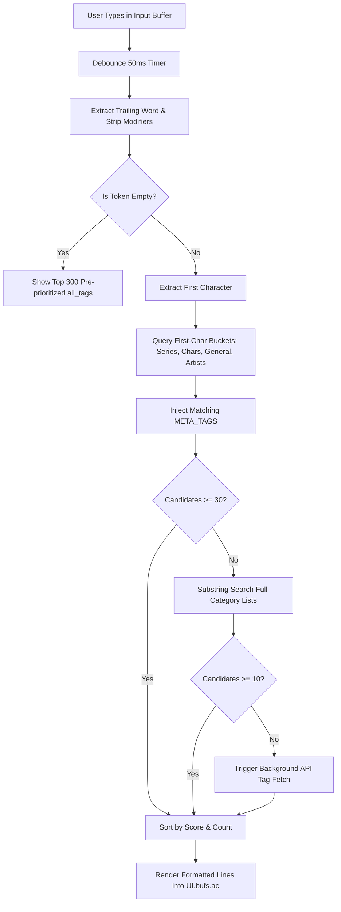

# AGENTS.md — Technical Architecture & Contributor Guide for `gelbooru.nvim`

This document is the primary technical reference and development guide for AI agents and human maintainers working on `gelbooru.nvim`. It provides an exhaustive, balanced description of the plugin's architecture, user interface, networking layer, tag database engine, autocomplete algorithms, image rendering pipeline, maintenance invariants, testing protocols, and development roadmap.

---

## 1. Executive Summary

`gelbooru.nvim` is a high-performance, asynchronous Neovim plugin designed for searching, browsing, and inspecting images and metadata from the Gelbooru imageboard directly inside the editor.

### Key Capabilities
- **Local Tag Indexing & Instant Autocomplete**: Loads and indexes 100k+ tags across five distinct categories (Series, Characters, Artists, General, Meta). Real-time debounced completion engine provides sub-3ms prefix lookups with popularity-weighted scoring, substring fallbacks, and dynamic API discovery.
- **In-Editor Image Rendering**: Leverages `snacks.image` (supporting Kitty graphics protocol, Ghostty, Wezterm, and terminal pixel renderers) to display high-resolution post previews inside floating windows. Includes video detection, local disk caching, prefetching, and fallback chains.
- **Interactive Multi-Window UI**: Floating layout featuring a top search bar, live autocomplete dropdown, scrollable post list, full image canvas, expandable metadata inspector, and status line.
- **Zero Heavy Runtime Dependencies**: Pure Lua codebase requiring only Neovim (>= 0.9.0), system `curl`, and an image backend (`snacks.nvim` or `image.nvim`).

---

## 2. User Experience, Commands & Keymap Surface

### 2.1 User Commands
- `:Gelbooru [tags]` (or `:Gelbooru`): Opens the browser window. If initial tags are passed (e.g. `:Gelbooru hatsune_miku rating:general`), immediately executes the search; otherwise opens with focus in the search bar and displays top recommended tags.
- `:GelbooruTags` (alias `:GelbooruTag`): Initiates the background tag scraper and database builder, downloading thousands of top tags from Gelbooru and categorizing them into local JSON databases. Displays a floating progress spinner.
- `require("gelbooru").setup(opts)`: Configures paths, network limits, prefetch radius, and logging.

### 2.2 Dual-Mode Interaction Model

The UI operates in two distinct modes: **Browse Mode** (when navigating the post list) and **Search Mode** (when typing into the input bar).

#### Browse Mode (List Window Focused)
When viewing posts, the post list window is focused with cursorline enabled:

| Key | Action | Technical Behavior |
|---|---|---|
| `j` / `k` | Move cursor down / up | Updates `State.cur` and `State.scroll_dir`. Updates history entry. Re-renders post list, triggers debounced preview render (30ms if cached, 150ms if remote), initiates background prefetching for adjacent posts, and auto-fetches the next page when nearing the boundary (`#posts - 5`). |
| `<CR>` | Save image | Downloads the full-resolution `file_url` to `config.options.save_dir` with a status notification. |
| `<Tab>` | Next Page | Fetches the next page (`pid = State.page + 1`) from the Gelbooru API and appends posts. |
| `<S-Tab>` | Previous Page | Rewinds to the previous page by removing the oldest batch of posts and decrementing `State.page`. |
| `r` | Re-render preview | Resets `State.cur_id` and re-renders the current post preview. |
| `R` | Force refresh | Invalidates local disk cache for the current post, deletes cached image, and re-downloads from source. |
| `m` | Toggle metadata | Toggles `State.show_meta` boolean. Recalculates floating layout dimensions via `calc_layout()`, hides or displays the metadata window (`wins.meta`) and divider (`wins.hdiv`), and adjusts the preview canvas height. |
| `o` | Open image URL | Spawns system default browser / viewer with `p.file_url`. |
| `O` | Open post page | Spawns system default browser with the full post web page (`https://gelbooru.com/index.php?page=post&s=view&id=...`). |
| `i`, `I`, `a`, `A`, `s`, `S`, `/` | Enter Search Mode | Shifts focus to the input window, enters insert mode, sets `State.input_focused = true`, pops open the autocomplete window (`wins.ac`), and updates completion candidates. |
| `[` / `]` | Previous / Next History | Navigates the search history stack (`history_prev` / `history_next`), restoring queries, post arrays, and cursor positions. |
| `<C-d>` / `<C-u>` | Scroll metadata | Scrolls the metadata text buffer down / up by 5 lines without shifting focus. |
| `<ScrollWheelDown>` / `<ScrollWheelUp>` | Scroll metadata | Scrolls metadata text buffer by 3 lines via mouse wheel. |
| `q` / `<Esc>` | Quit / Close | Initiates complete UI teardown: cancels timers, terminates in-flight downloads, closes all floating windows, resets state tables, and triggers garbage collection. |

#### Search Mode (Input Window Focused)
When typing in the query bar, the autocomplete window (`wins.ac`) displays matching tags ranked by relevance and category:

| Key | Action | Technical Behavior |
|---|---|---|
| `<Tab>` / `<Down>` / `<C-n>` | Navigate suggestion down | Sets `State.autocomplete_navigated = true`, increments `State.autocomplete_cur`, highlights the candidate line in `wins.ac`. |
| `<S-Tab>` / `<Up>` / `<C-p>` | Navigate suggestion up | Sets `State.autocomplete_navigated = true`, decrements `State.autocomplete_cur`, moves highlight line. |
| `<Space>` | Contextual select or space | **If user Tab-navigated (`autocomplete_navigated == true` and `cur > 0`)**: Selects the highlighted suggestion, appends it to the query with trailing space, resets navigation flag. Allows rapid chaining (e.g. Tab → Space selects `sort:score`).<br>**If user was typing**: Auto-selects only if typed word is an exact or normalized match to top suggestion; otherwise inserts literal space. |
| `<CR>` | Execute search | Reads full input line, exits insert mode, pushes query to history stack, resets pagination (`page = 0`, `cur = 1`), clears current post list, triggers `api.fetch(1)`, and starts background lookup for any unindexed query tags. |
| `<Esc>` | Cancel search | Exits insert mode, unfocuses input bar, hides autocomplete popup, returns focus to post list. |

---

## 3. Repository Architecture & File Hierarchy

```
gelbooru.nvim/
├── Makefile                          # Test runner, linter, single-spec targets
├── tests/
│   ├── minimal_init.lua              # Headless Neovim test bootstrap (rtp & plenary resolution)
│   └── unit/
│       ├── config_spec.lua           # Options, defaults, clamping, aliasing
│       ├── db_spec.lua               # Tag validation (is_clean_tag), indexing, bucketing
│       ├── history_spec.lua          # Stack push/pop/restore, reference semantics
│       ├── image_spec.lua            # URL parsing, video detection, cache targets
│       └── util_spec.lua             # URL encoding, entity decoding, fuzzy matching
└── lua/gelbooru/
    ├── init.lua                      # Top-level API entry point & user command bindings
    ├── core/
    │   ├── config.lua                # Configuration defaults, clamping, option normalization
    │   ├── state.lua                 # Global session state singleton (State & UI handles)
    │   ├── history.lua               # Query navigation stack with reference sharing
    │   ├── util.lua                  # Pure helpers (encoding, HTML decode, auth cache, window helpers)
    │   └── log.lua                   # Structured disk logger writing to stdpath("state")/gelbooru.log
    ├── net/
    │   ├── init.lua                  # Facade re-exporting API and download submodules
    │   ├── api.lua                   # Gelbooru XML/JSON API client & query execution
    │   └── download.lua              # Asynchronous curl download queue, dedup & prefetch scheduler
    ├── tags/
    │   ├── init.lua                  # Facade re-exporting db, fetcher, resolve submodules
    │   ├── db.lua                    # Tag loading, memory indexing, bucketing, validation
    │   ├── fetcher.lua               # Background scraper (:GelbooruTags) with checkpointing
    │   └── resolve.lua               # Post tag batch resolution & runtime discovered.json cache
    └── ui/
        ├── init.lua                  # Main UI coordinator (layout math, window lifecycle, keymaps)
        ├── autocomplete.lua          # Autocomplete engine (prefix bucketing, scoring, fallback)
        └── image.lua                 # Image placement coordinator (snacks.image, cache paths)
```

### Module Responsibilities

#### `lua/gelbooru/init.lua`
Public entry point. Exposes `setup(opts)`, `open(initial_tags)`, `browse()`, and `update_tags()`. Connects user-facing commands to core logic.

#### `lua/gelbooru/core/config.lua`
Holds the default configuration table. Normalizes user overrides, clamps numeric ranges using `math.max` and `math.min`, maps tag category IDs to badges and string names, and declares static `META_TAGS` (`sort:score`, `rating:general`, etc.).

#### `lua/gelbooru/core/state.lua`
Declares the two foundational singletons:
- `M.State`: Session runtime state (current query, posts array, pagination indices, current cursor, tag category lists, first-letter bucket indices, autocomplete buffers, history stack).
- `M.UI`: Window IDs, buffer IDs, autocmd group, active placement handle, and libuv timers (`scroll_timer`, `status_timer`, `api_tag_timer`, `ac_debounce_timer`, `save_discovered_timer`, `prefetch_timers`).
Provides lifecycle cleanup routines: `reset_query_state()`, `reset_ui()`, and `reset_tag_state()`.

#### `lua/gelbooru/core/history.lua`
Maintains an undo/redo navigation stack for search queries. Implements `save_current_history()`, `push_history(query)`, `restore_history(idx)`, `history_prev()`, and `history_next()`. **Critical optimization**: Stores `posts` arrays by reference instead of deep copying, preventing megabyte-scale memory ballooning during search navigation.

#### `lua/gelbooru/core/util.lua`
Pure utility functions:
- `url_encode(s)`: Replaces spaces with `+` and percent-encodes special characters (`:`, `&`, `=`, etc.) for query strings.
- `normalize_str(s)`: Strips non-alphanumeric characters and lowercases text for fuzzy and bucket comparison.
- `decode_html(str)`: Decodes HTML entities (`&gt;`, `&lt;`, `&amp;`, `&quot;`, `&#039;`, `&#39;`).
- `load_auth()` / `auth_qs()`: Reads `gelbooru_auth.json` and caches credentials in memory to eliminate repeated disk reads during API calls.
- `set_lines(buf, lines)` / `set_status(msg, reset_ms)`: Defensive buffer updating with modifiable state guards and auto-resetting status timers.
- `float(buf, r, c, w, h, opts)`: Floating window creation wrapper.

#### `lua/gelbooru/net/api.lua`
Handles Gelbooru REST API interactions (`index.php?page=dapi&s=post&q=index&json=1`). Implements:
- `fetch(direction)`: Forward (`direction=1`) and backward (`direction=-1`) post pagination.
- `execute_search(query)`: Pushes history, clears post state, triggers initial fetch, and parses search words to discover and categorize unrecognized tags.
- `save_current()`: Downloads the full-size `file_url` for the selected post into `save_dir`.
- `scroll_meta(dir)`: Adjusts cursor position inside the metadata floating window.

#### `lua/gelbooru/net/download.lua`
Network transfer engine using `vim.system({"curl", ...})`:
- `curl_async(url, cb)`: Lightweight async GET returning response body.
- `download_async(url, dest, cb)`: File downloader with deduplication (`active_downloads[dest]`), atomic writing via temporary `.part` files, referer headers, retry logic, and callback queue pruning.
- `prefetch_around(idx)`: Calculates prefetch indices based on `config.options.prefetch_radius` and scroll direction, scheduling staggered (50ms interval) async downloads into the local cache.

#### `lua/gelbooru/tags/db.lua`
Local tag indexing and categorization:
- `is_clean_tag(name, count, typ)`: Strict validation heuristic filtering out single-char tags, malformed strings, URLs, double separators, and invalid counts.
- `add_tag_to_index(tag, target_list, bucket_map)`: Stamped normalized names (`n_lower`, `norm`), appends to category list, inserts into global `tags_by_name`, and assigns to first-character lookup buckets.
- `load_tags()`: Reads `series.json`, `characters.json`, `artists.json`, `general.json`, and `discovered.json` from `tags_dir`. Builds `all_tags` prioritized composite list.

#### `lua/gelbooru/tags/fetcher.lua`
Tag database scraper (`:GelbooruTags`):
- Launches 8 concurrent worker loops fetching tag pages from Gelbooru ordered by count (`LIMIT = 100`).
- Preloads existing local tag databases to preserve previous entries.
- Renders an animated floating spinner window with live progress updates.
- Checkpoints progress by serializing split JSON files every 100 pages.

#### `lua/gelbooru/tags/resolve.lua`
Dynamic post tag categorization:
- `resolve_post_tags(post, on_complete)`: Extracts unindexed tags from a post, batches up to 40 at a time, queries the Gelbooru tag API, inserts discovered items into memory indices, and schedules persistence. Calls `on_complete` if an artist tag is resolved.
- `persist_discovered_tag(item)`: Appends discovered tags to `State.discovered` and debounces writing to `discovered.json` (500ms).
- `fetch_api_tags(query)`: Live fallback querying the API for tags matching prefix when local lookup returns < 10 results.

#### `lua/gelbooru/ui/init.lua`
The primary UI coordinator:
- Computes floating window coordinates (`calc_layout()`), caching geometry against terminal width/height and `show_meta` state.
- Creates and positions floating windows (`frame`, `input`, `div`, `list`, `vdiv`, `img`, `hdiv`, `meta`, `status`, `ac`).
- Sets window-local options (`cursorline`, highlights) and binds all keymaps.
- Manages image rendering queue and preview cooldown timers (`30ms` cached, `150ms` remote).
- Handles graceful window destruction and garbage collection on `teardown()`.

#### `lua/gelbooru/ui/autocomplete.lua`
Real-time tag autocompletion engine:
- Extracts trailing search token from the input buffer.
- Performs sub-3ms lookup using first-character bucket tables.
- Evaluates candidate scores combining match quality, category nudges, and `log10(count + 1)` popularity weighting.
- Executes full-list substring fallback when bucket search yields < 30 matches.
- Populates `UI.bufs.ac` with formatted badges and post counts.

#### `lua/gelbooru/ui/image.lua`
Image presentation coordinator:
- `get_preview_targets(post)`: Resolves preview URL hierarchy (`sample_url` -> `preview_url` -> `file_url`) and constructs cache paths (`prev_<id>.<ext>`).
- `is_video_post(post)`: Detects `.mp4` and `.webm` media.
- `render_image(win, path, width, height)`: Interacts with `snacks.image.placement`. Creates a wipe-buffer, establishes placement, sets the new buffer on the window **before** deleting the old buffer, and calls `placement.update()`.

---

## 4. Subsystem Deep-Dives

### 4.1 Window Layout Hierarchy & Geometry

`ui/init.lua` calculates a unified layout occupying 95% of terminal width and height (clamped to minimum 80 columns × 20 rows):

```
┌────────────────────────────────── frame (95% W x 95% H) ───────────────────────────────────┐
│ input: search query bar                                                       [zindex: 51] │
├────────────────────────────────── div: horizontal rule ────────────────────────────────────┤
│ list: 25% W           │ img: 75% W                                                         │
│ [▶] R ★Score Dims Tags│ Display canvas rendered via snacks.image                           │
│                       │                                                                    │
│                       ├────────────────── hdiv: horizontal rule ───────────────────────────┤
│                       │ meta: 35% of main_h (toggleable with 'm')                          │
│                       │ ID, Rating, Score, Dimensions, Source, Artists, Categorized Tags   │
├────────────────────────────────── status: 1-line bar ──────────────────────────────────────┤
│ status: keymap shortcuts, active page/fetch status, notifications             [zindex: 51] │
└────────────────────────────────────────────────────────────────────────────────────────────┘
        ▲
        │ (When typing, autocomplete dropdown overlays top section)
┌───────┴────────────────────────── ac: autocomplete popup ──────────────────────────────────┐
│ ▶ sort:score                                       [Meta   ]        -         [zindex: 60] │
│   hatsune_miku                                     [Char   ]   142850                      │
│   vocaloid                                         [Series ]   215400                      │
└────────────────────────────────────────────────────────────────────────────────────────────┘
```

#### Geometry Calculation (`calc_layout`)
- Total Width $W = \max(80, \lfloor \text{columns} \times 0.95 \rfloor)$
- Total Height $H = \max(20, \lfloor \text{lines} \times 0.95 \rfloor)$
- Left List Width: $\lfloor W \times 0.25 \rfloor$
- Right Preview Width: $W - \text{list\_w} - 3$
- Meta Panel Height: If `State.show_meta` is true, $\min(12, \lfloor \text{main\_h} \times 0.35 \rfloor)$; otherwise 0.
- Image Canvas Height: $\text{main\_h} - \text{meta\_h} - (\text{show\_meta} ? 1 : 0)$
- Autocomplete Window: Positioned at row $R + 2$, height $\min(15, H - 4)$, z-index 60.

### 4.2 Autocomplete Algorithm & Scoring Pipeline

The autocomplete engine (`ui/autocomplete.lua`) is designed to respond within 3ms across 100k+ loaded tags without blocking the Neovim main thread.



#### Scoring Formula
For each candidate tag matching query $q$:
1. **Match Quality Base Score ($S_{\text{base}}$)**:
   - Exact lowercase match: $35.0$
   - Exact normalized alphanumeric match: $30.0$
   - Prefix lowercase match: $20.0$
   - Prefix normalized match: $15.0$
   - Substring match: $5.0$
2. **Category Weight Nudge ($S_{\text{cat}}$)**:
   - Series / Copyright: $+2.0$
   - Character: $+1.0$
   - Artist: $+0.5$ (prefix-only matching by default)
   - General: $+0.0$
3. **Popularity Weighting ($S_{\text{pop}}$)**:
   $$S_{\text{pop}} = \log_{10}(\text{post\_count} + 1) \times 10.0$$
4. **Total Score**:
   $$\text{Score} = \begin{cases} 1000.0 & \text{if tag is Type 5 (Meta)} \\ S_{\text{base}} + S_{\text{cat}} + S_{\text{pop}} & \text{otherwise} \end{cases}$$

Candidates are sorted primarily by `score` descending, secondarily by `count` descending, and tertiarily by name alphabetically. Top 150 items are displayed.

### 4.3 Image Placement & Buffer Lifecycle

Rendering images inside floating Neovim windows requires strict sequencing to avoid crashes, buffer leaks, or window flickering:

1. **Target Selection**:
   `image.get_preview_targets(post)` checks URLs in order:
   - `sample_url` (preferred for preview canvas)
   - `preview_url` (fallback thumbnail)
   - `file_url` (original image)
   Constructs local cache destination: `cache_dir .. "/prev_" .. post.id .. "." .. ext`.
2. **Disk Cache Check**:
   If the file exists and is $> 1024$ bytes, it renders immediately. If missing, `download.download_async` downloads the image via `curl` to a `.part` temporary file before atomically renaming it.
3. **Buffer Swapping Invariant**:
   `snacks.image` tracks placements by buffer handle. When swapping an image:
   ```lua
   local new_buf = vim.api.nvim_create_buf(false, true)
   vim.bo[new_buf].bufhidden = "wipe"
   local placement = placement_mod.new(new_buf, path, opts)

   -- CRITICAL SEQUENCE:
   local old_buf = UI.current_placement and UI.current_placement.buf
   UI.current_placement = placement
   vim.api.nvim_win_set_buf(win, new_buf) -- Set new buffer FIRST
   if old_buf and vim.api.nvim_buf_is_valid(old_buf) then
     pcall(vim.api.nvim_buf_delete, old_buf, { force = true }) -- Delete old buffer SECOND
   end
   placement:update()
   ```
   *Never delete the old buffer before setting the new one on the window*, as doing so breaks placement tracking and blanks the image canvas.

### 4.4 Tag Database Architecture

The tag database is organized in `config.options.tags_dir` (default: `~/.local/share/nvim/gelbooru/`):
- `series.json`: Type 3 tags (anime, game, manga franchises).
- `characters.json`: Type 4 tags (fictional characters).
- `artists.json`: Type 1 tags (illustrators, circle names).
- `general.json`: Type 0 tags (descriptive attributes, clothing, poses, count $\ge 10$).
- `discovered.json`: Runtime cache of tags resolved from post inspections and unknown query inputs.

#### Tag Object Schema
```json
{
  "n": "hatsune_miku",
  "c": 142850,
  "t": 4
}
```
In memory, `add_tag_to_index` stamps two additional fields:
- `n_lower`: Lowercase string representation (`"hatsune_miku"`).
- `norm`: Alphanumeric-only normalized string for fuzzy matching (`"hatsunemiku"`).

---

## 5. Configuration Reference

Options passed to `require("gelbooru").setup(opts)`:

| Option | Type | Default | Description |
|---|---|---|---|
| `save_dir` | `string` | `"~/Pictures/Gelbooru"` | Local directory where full images are saved on `<CR>`. |
| `auth_file` | `string` | `stdpath("config") .. "/gelbooru_auth.json"` | Path to JSON file with API credentials (`api_key`, `user_id`). |
| `tags_dir` | `string` | `stdpath("data") .. "/gelbooru"` | Storage directory for local tag category databases. |
| `cache_dir` | `string` | `"/tmp/gelbooru_cache"` | Ephemeral disk cache for downloaded preview images. |
| `log_level` | `string` | `"WARN"` | Minimum log verbosity (`"DEBUG"`, `"INFO"`, `"WARN"`, `"ERROR"`). |
| `log_file` | `string` | `stdpath("state") .. "/gelbooru.log"` | Target path for disk logging. |
| `api_base` | `string` | `"https://gelbooru.com/index.php?page=dapi&s=post&q=index&json=1"` | Posts API endpoint. |
| `tags_api` | `string` | `"https://gelbooru.com/index.php?page=dapi&s=tag&q=index&json=1"` | Tags API endpoint. |
| `per_page` | `number` | `42` | Number of posts per page. Clamped between 1 and 100. |
| `prefetch_radius`| `number` | `5` | Images ahead/behind to preload. Clamped between 0 and 20. |
| `show_tags_in_list`| `boolean`| `false` | When true, renders raw tag text inside list sidebar rows. |

### Authentication Setup
Create `~/.config/nvim/gelbooru_auth.json`:
```json
{
  "api_key": "YOUR_GELBOORU_API_KEY",
  "user_id": "YOUR_GELBOORU_USER_ID"
}
```
When configured, `util.auth_qs()` automatically appends `&api_key=...&user_id=...` to all post and tag API calls.

---

## 6. Critical Invariants & Maintenance Rules

Any agent or contributor modifying `gelbooru.nvim` **MUST** adhere to these runtime invariants:

### 1. LuaJIT Memory Allocation Pool Discipline
- **LuaJIT Virtual Memory Behavior**: LuaJIT uses an internal `malloc` arena. Virtual memory allocated from the operating system is **never returned to the OS**, even after garbage collection sweeps all unreferenced objects. Consequently, resident memory (RSS) will not return to zero after closing the UI.
- **Strict Prohibition of `vim.deepcopy` on Posts/Tags**: Post tables contain dozens of fields. Never call `vim.deepcopy` on `State.posts` or tag category arrays. Store and pass posts by reference across history and UI layers.
- **Teardown Garbage Collection**: `ui/init.lua:teardown()` must nil out all state tables and call `collectgarbage("collect")` twice to reclaim tag and buffer memory immediately.

### 2. Window and Buffer Deletion Ordering
- To avoid invalidating `snacks.image` placements or causing UI flicker, always set the window's buffer to the new buffer **before** deleting the superseded buffer:
  ```lua
  pcall(vim.api.nvim_win_set_buf, win, new_buf)
  if old_buf and vim.api.nvim_buf_is_valid(old_buf) then
    pcall(vim.api.nvim_buf_delete, old_buf, { force = true })
  end
  ```

### 3. Asynchronous Safety & Defensive Window/Cursor Operations
- Network callbacks (`curl_async`), timers, and `vim.schedule` blocks often resolve after the user has closed the UI (`teardown()`).
- Always verify `vim.api.nvim_win_is_valid(win)` and `vim.api.nvim_buf_is_valid(buf)` before setting lines, cursor position, or configuration.
- Wrap all `nvim_win_set_cursor` and `nvim_set_current_win` calls in `pcall`.

### 4. Lua Array Iteration Trap (`ipairs` on `nil`)
- In Lua, `ipairs` terminates iteration at the very first `nil` element (index 1).
- Never place expressions that may evaluate to `nil` (such as environment variables) inside an array literal:
  ```lua
  -- BUG: If TEST_PLENARY is unset, candidates[1] is nil, loop terminates immediately!
  local candidates = { os.getenv("TEST_PLENARY"), "/path/a", "/path/b" }

  -- CORRECT:
  local candidates = {}
  local env = os.getenv("TEST_PLENARY")
  if env and env ~= "" then table.insert(candidates, env) end
  table.insert(candidates, "/path/a")
  ```

### 5. Download Queue Closure Management
- `download.active_downloads` maps destination file paths to callback arrays. During rapid scrolling, do not allow unbounded closures to accumulate. Prefetch requests must overwrite or discard superseded callbacks to release captured closures.

---

## 7. Testing, Tooling & Verification

The repository includes a comprehensive unit testing suite using `plenary.nvim` and syntax linting via `luajit`.

### Available Commands

| Command | Action |
|---|---|
| `make test` | Runs all 79+ unit specs headlessly using `plenary.busted`. |
| `make spec FILE=tests/unit/util_spec.lua` | Runs a single test specification file. |
| `make lint` | Runs `luajit -bl` (bytecode check) across all 16 Lua source files. |

### Test Structure
- `tests/minimal_init.lua`: Headless test bootstrap. Discovers `plenary.nvim` from:
  1. `TEST_PLENARY` environment variable.
  2. `~/.local/share/nvim/lazy/plenary.nvim`.
  3. `~/.local/share/nvim/site/pack/packer/start/plenary.nvim`.
- `tests/unit/`:
  - `config_spec.lua`: Default options, clamping boundaries, key aliasing.
  - `db_spec.lua`: `is_clean_tag` validation rules, tag indexing, bucketing.
  - `history_spec.lua`: Navigation stack push, pop, restore, reference retention.
  - `image_spec.lua`: URL parsing, video post detection, preview target generation.
  - `util_spec.lua`: URL encoding (spaces to `+`, colons, query params), entity decoding, normalization.

---

## 8. Prioritized Roadmap & Planned Changes

All outstanding tasks, known issues, and planned refactorings are consolidated here:

### Priority 1: UI Auto-Update & Image Rescaling on State Changes
- **Image rescaling on meta toggle (`m`)**: When `show_meta` is toggled in `ui/init.lua`, `calc_layout()` and `apply_layout()` resize the floating windows (`UI.wins.img`), but `snacks.image.placement` is not updated with the new floating window dimensions (`l.img.width`, `l.img.height`). This causes the terminal image renderer to crop the image canvas to the old window bounds instead of scaling it dynamically. The image only updates to the new size when navigating to another post or pressing `r`.
  - *Required Fix*: In `ui/init.lua:on_resize()`, update active placement dimensions or trigger an in-place re-render (`load_and_render_image(p, 1, 0, false)`) so the image smoothly scales to fit the resized preview canvas immediately.
- **Meta panel refresh on artist resolution**: *(RESOLVED)* Resetting `State.cur_id = nil` inside the `resolve_post_tags()` completion callback in `ui/init.lua` bypasses the deduplication guard and refreshes `UI.bufs.meta` when an artist tag is resolved.

### Priority 2: Discovered Tags Transfer to Main Tag Files
- **Context**: During browsing, newly resolved tags accumulate in `discovered.json`. Currently, they remain in `discovered.json` indefinitely and are not incorporated into the primary category databases (`series.json`, `characters.json`, `artists.json`, `general.json`).
- **Required Change**: When `:GelbooruTags` (`fetcher.lua`) executes a full update:
  1. Load existing entries from `discovered.json`.
  2. Merge matching tags into `series_map`, `chars_map`, `artists_map`, or `general_map`.
  3. Prune transferred tags from `discovered.json` so it only retains items not yet absorbed into main databases. (Do **not** enforce a hardcap; perform clean transfer and pruning).

### Priority 3: Tag Scraper Filter Consistency & Quality
- **Context**: In `tags/fetcher.lua` (line 51), a local helper `is_valid_name()` is used instead of the canonical `tags/db.lua:is_clean_tag()`.
- **Required Change**: Unify tag filtering in `fetcher.lua` to use `db.is_clean_tag()`, ensuring that count constraints, symbol exclusions, and disambiguation paren rules are consistently applied before serializing tags to disk.

### Priority 4: Architectural Modularization
- **Modularize `ui/init.lua` (~800 lines)**:
  Partition the monolithic UI orchestrator into dedicated submodules:
  - `lua/gelbooru/ui/layout.lua`: Window coordinate calculations and divider line generation.
  - `lua/gelbooru/ui/keymaps.lua`: Normal and insert mode buffer keybindings.
  - `lua/gelbooru/ui/render.lua`: Text formatting and buffer painting for post list and metadata panels.
  - `lua/gelbooru/ui/lifecycle.lua`: Window opening, resizing, and teardown routines.
- **Simplify `config.setup()`**: Replace manual option copying with `vim.tbl_deep_extend("force", M.options, opts)` while preserving clamping validations.
- **Standardize Facade Imports**: Rationalize `net/init.lua` and `tags/init.lua` so callers consistently import either submodules or the facade, eliminating mixed imports.
- **Extract Named Constants**: Replace hardcoded magic numbers (autocomplete debounce `50ms`, preview cooldown `150ms`, tag batch size `40`, truncate width `46`) with descriptive constants in `core/config.lua`.

### Priority 5: Direct Post ID Search
- **Context**: Users often know the exact Gelbooru post ID (from a URL, shared link, or previous session) and want to navigate directly to that post without a tag search.
- **Required Change**:
  1. **Input detection**: In `net/api.lua:execute_search()`, detect when the query is a bare integer (e.g. `"12345678"`) or matches the pattern `id:<number>`. When detected, short-circuit the normal tag query.
  2. **API fetch**: Issue a direct single-post API call: `index.php?page=dapi&s=post&q=index&json=1&id=<ID>`. On success, insert the single post into `State.posts`, set `State.cur = 1`, and call `ui.render_list()` + `ui.render_preview(false)`.
  3. **UX detail**: Set status to `"Post #<ID>"` while fetching. If the post is not found (empty response or API error), fall back to displaying `"No post found for ID <ID>"`.
  4. **History**: Push the query string (`"id:<ID>"`) to history stack as normal so `[` / `]` navigation works.
  5. **Autocomplete hint**: Add `"id:"` to `META_TAGS` in `core/config.lua` so it appears as a suggestion when the user types `id` in the search bar.
- **Integration test**: Add `tests/integration/search_spec.lua` coverage for the ID lookup path: mock a single-post API response and assert `State.posts[1].id == <queried_id>` and `State.cur == 1`.

### Priority 6: Testing Infrastructure & Maintenance Guidelines
- **Suite Composition**:
  - `tests/unit/` (5 specs, 79 assertions): Fast, headless unit tests covering pure transformations (`config`, `db`, `history`, `image`, `util`).
  - `tests/integration/` (4 specs, 11 assertions): End-to-end integration tests using Neovim API + headless event loop + mock networking layer (`harness`, `mock_net`, `mock_snacks`). Covers real UI window/buffer creation, search execution, layout recalculation, autocomplete buffer population, and regression guards.
- **Mock Infrastructure (`tests/integration/helpers/`)**:
  - `mock_net.lua`: Stubs `download.curl_async` (returns mock JSON payloads via `vim.schedule`) and `download.download_async` (creates a dummy 2KB image file on disk).
  - `mock_snacks.lua`: Mocks `snacks.image.placement` to record placement objects without needing Kitty graphics hardware or terminal capabilities.
  - `harness.lua`: Manages environment setup/teardown between tests, calling `ui.teardown()` and resetting singletons (`State`, `UI`).
- **Test Brittleness & Maintenance Rules**:
  1. **Do not use `vim.wait()` for synchronous callback asserts**: In headless Neovim (`nvim --headless`), `vim.wait()` pumps the event loop, but callbacks scheduled via `vim.schedule` inside deeply nested callbacks may not always execute within arbitrary sleep windows. When testing logic that depends on `vim.schedule` (such as `tags.resolve_post_tags`), register state directly or invoke the callback synchronously instead of polling with `vim.wait()`.
  2. **Input buffer state in integration tests**: `ui.open()` initializes `UI.bufs.input` to `""`. When testing re-submitted queries via `api.execute_search(query)`, pass `state.State.query` explicitly so the early-return path (`query == State.query`) is properly exercised.
  3. **Placement mock assertions**: `mock_snacks` tracks placement objects in `state.UI.current_placement`. When testing `on_resize()` or layout changes, verify placement fields (`buf`, `src`, `closed`) directly rather than checking visual terminal pixel output.
  4. **Running tests**: `make test` runs all unit + integration specs. `make spec FILE=tests/integration/regressions_spec.lua` runs a single spec. `make lint` checks Lua syntax via `luajit -bl`.

### Priority 7: Real UI & Event Loop Integration Test Suite
- **Context**: Existing unit specs (`tests/unit/`) only test headless pure Lua data transformations (`url_encode`, `is_clean_tag`, history math). They do not catch Neovim floating window buffer switching races, event loop timer ordering, or search exit list repainting.
- **Required Integration Specs**:
  - `tests/integration/search_spec.lua`: Test search entry, query submission, list buffer repainting (`UI.bufs.list`), cursor reset (`State.cur = 1`), and history stack updates.
  - `tests/integration/layout_spec.lua`: Test metadata window toggle (`m`), window config updates, and buffer assignments across `on_resize()`.
  - `tests/integration/resolve_spec.lua`: Test async tag resolution callbacks updating the metadata panel without mutating active preview cursor state.
