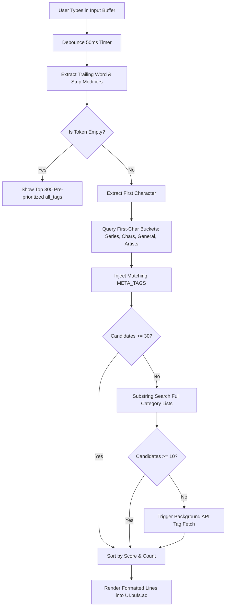

# AGENTS.md — Technical Architecture & Contributor Guide for `gelbooru.nvim`

This document is the primary technical reference and development guide for AI agents and human maintainers working on `gelbooru.nvim`. It provides an exhaustive, balanced description of the plugin's architecture, user interface, networking layer, tag database engine, autocomplete algorithms, image rendering pipeline, maintenance invariants, testing protocols, and development roadmap.

---

## 1. Executive Summary

`gelbooru.nvim` is a high-performance, asynchronous Neovim plugin designed for searching, browsing, and inspecting images and metadata from the Gelbooru imageboard directly inside the editor.

### Key Capabilities
- **Local Tag Indexing & Instant Autocomplete**: Loads and indexes 100k+ tags across five distinct categories (Series, Characters, Artists, General, Meta). Real-time debounced completion engine provides sub-3ms prefix lookups with popularity-weighted scoring, substring fallbacks, and dynamic API discovery.
- **In-Editor Image Rendering**: Leverages `snacks.image` (supporting Kitty graphics protocol, Ghostty, Wezterm, and terminal pixel renderers) to display high-resolution post previews inside floating windows. Includes video detection, local disk caching, prefetching, and fallback chains.
- **Interactive Multi-Window UI**: Floating layout featuring a top search bar, live autocomplete dropdown, scrollable post list, full image canvas, expandable metadata inspector, and status line.
- **Zero Heavy Runtime Dependencies**: Pure Lua codebase requiring only Neovim (>= 0.9.0), system `curl`, and an image backend (`snacks.nvim` or `image.nvim`).

---

## 2. User Experience, Commands & Keymap Surface

### 2.1 User Commands
- `:Gelbooru [tags]` (or `:Gelbooru`): Opens the browser window. If initial tags are passed (e.g. `:Gelbooru hatsune_miku rating:general`), immediately executes the search; otherwise opens with focus in the search bar and displays top recommended tags.
- `:GelbooruTags` (alias `:GelbooruTag`): Initiates the background tag scraper and database builder, downloading thousands of top tags from Gelbooru and categorizing them into local JSON databases. Displays a floating progress spinner.
- `require("gelbooru").setup(opts)`: Configures paths, network limits, prefetch radius, and logging.

### 2.2 Dual-Mode Interaction Model

The UI operates in two distinct modes: **Browse Mode** (when navigating the post list) and **Search Mode** (when typing into the input bar).

#### Browse Mode (List Window Focused)
When viewing posts, the post list window is focused with cursorline enabled:

| Key | Action | Technical Behavior |
|---|---|---|
| `j` / `k` | Move cursor down / up | Updates `State.cur` and `State.scroll_dir`. Updates history entry. Re-renders post list, triggers debounced preview render (30ms if cached, 150ms if remote), initiates background prefetching for adjacent posts, and auto-fetches the next page when nearing the boundary (`#posts - 5`). |
| `<CR>` | Save image | Downloads the full-resolution `file_url` to `config.options.save_dir` with a status notification. |
| `<Tab>` | Next Page | Fetches the next page (`pid = State.page + 1`) from the Gelbooru API and appends posts. |
| `<S-Tab>` | Previous Page | Rewinds to the previous page by removing the oldest batch of posts and decrementing `State.page`. |
| `r` | Re-render preview | Resets `State.cur_id` and re-renders the current post preview. |
| `R` | Force refresh | Invalidates local disk cache for the current post, deletes cached image, and re-downloads from source. |
| `m` | Toggle metadata | Toggles `State.show_meta` boolean. Recalculates floating layout dimensions via `calc_layout()`, hides or displays the metadata window (`wins.meta`) and divider (`wins.hdiv`), and adjusts the preview canvas height. |
| `o` | Open image URL | Spawns system default browser / viewer with `p.file_url`. |
| `O` | Open post page | Spawns system default browser with the full post web page (`https://gelbooru.com/index.php?page=post&s=view&id=...`). |
| `i`, `I`, `a`, `A`, `s`, `S`, `/` | Enter Search Mode | Shifts focus to the input window, enters insert mode, sets `State.input_focused = true`, pops open the autocomplete window (`wins.ac`), and updates completion candidates. |
| `[` / `]` | Previous / Next History | Navigates the search history stack (`history_prev` / `history_next`), restoring queries, post arrays, and cursor positions. |
| `<C-d>` / `<C-u>` | Scroll metadata | Scrolls the metadata text buffer down / up by 5 lines without shifting focus. |
| `<ScrollWheelDown>` / `<ScrollWheelUp>` | Scroll metadata | Scrolls metadata text buffer by 3 lines via mouse wheel. |
| `q` / `<Esc>` | Quit / Close | Initiates complete UI teardown: cancels timers, terminates in-flight downloads, closes all floating windows, resets state tables, and triggers garbage collection. |

#### Search Mode (Input Window Focused)
When typing in the query bar, the autocomplete window (`wins.ac`) displays matching tags ranked by relevance and category:

| Key | Action | Technical Behavior |
|---|---|---|
| `<Tab>` / `<Down>` / `<C-n>` | Navigate suggestion down | Sets `State.autocomplete_navigated = true`, increments `State.autocomplete_cur`, highlights the candidate line in `wins.ac`. |
| `<S-Tab>` / `<Up>` / `<C-p>` | Navigate suggestion up | Sets `State.autocomplete_navigated = true`, decrements `State.autocomplete_cur`, moves highlight line. |
| `<Space>` | Contextual select or space | **If user Tab-navigated (`autocomplete_navigated == true` and `cur > 0`)**: Selects the highlighted suggestion, appends it to the query with trailing space, resets navigation flag. Allows rapid chaining (e.g. Tab → Space selects `sort:score`).<br>**If user was typing**: Auto-selects only if typed word is an exact or normalized match to top suggestion; otherwise inserts literal space. |
| `<CR>` | Execute search | Reads full input line, exits insert mode, pushes query to history stack, resets pagination (`page = 0`, `cur = 1`), clears current post list, triggers `api.fetch(1)`, and starts background lookup for any unindexed query tags. |
| `<Esc>` | Cancel search | Exits insert mode, unfocuses input bar, hides autocomplete popup, returns focus to post list. |

---

## 3. Repository Architecture & File Hierarchy

```
gelbooru.nvim/
├── Makefile                          # Test runner, linter, single-spec targets
├── tests/
│   ├── minimal_init.lua              # Headless Neovim test bootstrap (rtp & plenary resolution)
│   └── unit/
│       ├── config_spec.lua           # Options, defaults, clamping, aliasing
│       ├── db_spec.lua               # Tag validation (is_clean_tag), indexing, bucketing
│       ├── history_spec.lua          # Stack push/pop/restore, reference semantics
│       ├── image_spec.lua            # URL parsing, video detection, cache targets
│       └── util_spec.lua             # URL encoding, entity decoding, fuzzy matching
└── lua/gelbooru/
    ├── init.lua                      # Top-level API entry point & user command bindings
    ├── core/
    │   ├── config.lua                # Configuration defaults, clamping, option normalization
    │   ├── state.lua                 # Global session state singleton (State & UI handles)
    │   ├── history.lua               # Query navigation stack with reference sharing
    │   ├── util.lua                  # Pure helpers (encoding, HTML decode, auth cache, window helpers)
    │   └── log.lua                   # Structured disk logger writing to stdpath("state")/gelbooru.log
    ├── net/
    │   ├── init.lua                  # Facade re-exporting API and download submodules
    │   ├── api.lua                   # Gelbooru XML/JSON API client & query execution
    │   └── download.lua              # Asynchronous curl download queue, dedup & prefetch scheduler
    ├── tags/
    │   ├── init.lua                  # Facade re-exporting db, fetcher, resolve submodules
    │   ├── db.lua                    # Tag loading, memory indexing, bucketing, validation
    │   ├── fetcher.lua               # Background scraper (:GelbooruTags) with checkpointing
    │   └── resolve.lua               # Post tag batch resolution & runtime discovered.json cache
    └── ui/
        ├── init.lua                  # Main UI coordinator (layout math, window lifecycle, keymaps)
        ├── autocomplete.lua          # Autocomplete engine (prefix bucketing, scoring, fallback)
        └── image.lua                 # Image placement coordinator (snacks.image, cache paths)
```

### Module Responsibilities

#### `lua/gelbooru/init.lua`
Public entry point. Exposes `setup(opts)`, `open(initial_tags)`, `browse()`, and `update_tags()`. Connects user-facing commands to core logic.

#### `lua/gelbooru/core/config.lua`
Holds the default configuration table. Normalizes user overrides, clamps numeric ranges using `math.max` and `math.min`, maps tag category IDs to badges and string names, and declares static `META_TAGS` (`sort:score`, `rating:general`, etc.).

#### `lua/gelbooru/core/state.lua`
Declares the two foundational singletons:
- `M.State`: Session runtime state (current query, posts array, pagination indices, current cursor, tag category lists, first-letter bucket indices, autocomplete buffers, history stack).
- `M.UI`: Window IDs, buffer IDs, autocmd group, active placement handle, and libuv timers (`scroll_timer`, `status_timer`, `api_tag_timer`, `ac_debounce_timer`, `save_discovered_timer`, `prefetch_timers`).
Provides lifecycle cleanup routines: `reset_query_state()`, `reset_ui()`, and `reset_tag_state()`.

#### `lua/gelbooru/core/history.lua`
Maintains an undo/redo navigation stack for search queries. Implements `save_current_history()`, `push_history(query)`, `restore_history(idx)`, `history_prev()`, and `history_next()`. **Critical optimization**: Stores `posts` arrays by reference instead of deep copying, preventing megabyte-scale memory ballooning during search navigation.

#### `lua/gelbooru/core/util.lua`
Pure utility functions:
- `url_encode(s)`: Replaces spaces with `+` and percent-encodes special characters (`:`, `&`, `=`, etc.) for query strings.
- `normalize_str(s)`: Strips non-alphanumeric characters and lowercases text for fuzzy and bucket comparison.
- `decode_html(str)`: Decodes HTML entities (`&gt;`, `&lt;`, `&amp;`, `&quot;`, `&#039;`, `&#39;`).
- `load_auth()` / `auth_qs()`: Reads `gelbooru_auth.json` and caches credentials in memory to eliminate repeated disk reads during API calls.
- `set_lines(buf, lines)` / `set_status(msg, reset_ms)`: Defensive buffer updating with modifiable state guards and auto-resetting status timers.
- `float(buf, r, c, w, h, opts)`: Floating window creation wrapper.

#### `lua/gelbooru/net/api.lua`
Handles Gelbooru REST API interactions (`index.php?page=dapi&s=post&q=index&json=1`). Implements:
- `fetch(direction)`: Forward (`direction=1`) and backward (`direction=-1`) post pagination.
- `execute_search(query)`: Pushes history, clears post state, triggers initial fetch, and parses search words to discover and categorize unrecognized tags.
- `save_current()`: Downloads the full-size `file_url` for the selected post into `save_dir`.
- `scroll_meta(dir)`: Adjusts cursor position inside the metadata floating window.

#### `lua/gelbooru/net/download.lua`
Network transfer engine using `vim.system({"curl", ...})`:
- `curl_async(url, cb)`: Lightweight async GET returning response body.
- `download_async(url, dest, cb)`: File downloader with deduplication (`active_downloads[dest]`), atomic writing via temporary `.part` files, referer headers, retry logic, and callback queue pruning.
- `prefetch_around(idx)`: Calculates prefetch indices based on `config.options.prefetch_radius` and scroll direction, scheduling staggered (50ms interval) async downloads into the local cache.

#### `lua/gelbooru/tags/db.lua`
Local tag indexing and categorization:
- `is_clean_tag(name, count, typ)`: Strict validation heuristic filtering out single-char tags, malformed strings, URLs, double separators, and invalid counts.
- `add_tag_to_index(tag, target_list, bucket_map)`: Stamped normalized names (`n_lower`, `norm`), appends to category list, inserts into global `tags_by_name`, and assigns to first-character lookup buckets.
- `load_tags()`: Reads `series.json`, `characters.json`, `artists.json`, `general.json`, and `discovered.json` from `tags_dir`. Builds `all_tags` prioritized composite list.

#### `lua/gelbooru/tags/fetcher.lua`
Tag database scraper (`:GelbooruTags`):
- Launches 8 concurrent worker loops fetching tag pages from Gelbooru ordered by count (`LIMIT = 100`).
- Preloads existing local tag databases to preserve previous entries.
- Renders an animated floating spinner window with live progress updates.
- Checkpoints progress by serializing split JSON files every 100 pages.

#### `lua/gelbooru/tags/resolve.lua`
Dynamic post tag categorization:
- `resolve_post_tags(post, on_complete)`: Extracts unindexed tags from a post, batches up to 40 at a time, queries the Gelbooru tag API, inserts discovered items into memory indices, and schedules persistence. Calls `on_complete` if an artist tag is resolved.
- `persist_discovered_tag(item)`: Appends discovered tags to `State.discovered` and debounces writing to `discovered.json` (500ms).
- `fetch_api_tags(query)`: Live fallback querying the API for tags matching prefix when local lookup returns < 10 results.

#### `lua/gelbooru/ui/init.lua`
The primary UI coordinator:
- Computes floating window coordinates (`calc_layout()`), caching geometry against terminal width/height and `show_meta` state.
- Creates and positions floating windows (`frame`, `input`, `div`, `list`, `vdiv`, `img`, `hdiv`, `meta`, `status`, `ac`).
- Sets window-local options (`cursorline`, highlights) and binds all keymaps.
- Manages image rendering queue and preview cooldown timers (`30ms` cached, `150ms` remote).
- Handles graceful window destruction and garbage collection on `teardown()`.

#### `lua/gelbooru/ui/autocomplete.lua`
Real-time tag autocompletion engine:
- Extracts trailing search token from the input buffer.
- Performs sub-3ms lookup using first-character bucket tables.
- Evaluates candidate scores combining match quality, category nudges, and `log10(count + 1)` popularity weighting.
- Executes full-list substring fallback when bucket search yields < 30 matches.
- Populates `UI.bufs.ac` with formatted badges and post counts.

#### `lua/gelbooru/ui/image.lua`
Image presentation coordinator:
- `get_preview_targets(post)`: Resolves preview URL hierarchy (`sample_url` -> `preview_url` -> `file_url`) and constructs cache paths (`prev_<id>.<ext>`).
- `is_video_post(post)`: Detects `.mp4` and `.webm` media.
- `render_image(win, path, width, height)`: Interacts with `snacks.image.placement`. Creates a wipe-buffer, establishes placement, sets the new buffer on the window **before** deleting the old buffer, and calls `placement.update()`.

---

## 4. Subsystem Deep-Dives

### 4.1 Window Layout Hierarchy & Geometry

`ui/init.lua` calculates a unified layout occupying 95% of terminal width and height (clamped to minimum 80 columns × 20 rows):

```
┌────────────────────────────────── frame (95% W x 95% H) ───────────────────────────────────┐
│ input: search query bar                                                       [zindex: 51] │
├────────────────────────────────── div: horizontal rule ────────────────────────────────────┤
│ list: 25% W           │ img: 75% W                                                         │
│ [▶] R ★Score Dims Tags│ Display canvas rendered via snacks.image                           │
│                       │                                                                    │
│                       ├────────────────── hdiv: horizontal rule ───────────────────────────┤
│                       │ meta: 35% of main_h (toggleable with 'm')                          │
│                       │ ID, Rating, Score, Dimensions, Source, Artists, Categorized Tags   │
├────────────────────────────────── status: 1-line bar ──────────────────────────────────────┤
│ status: keymap shortcuts, active page/fetch status, notifications             [zindex: 51] │
└────────────────────────────────────────────────────────────────────────────────────────────┘
        ▲
        │ (When typing, autocomplete dropdown overlays top section)
┌───────┴────────────────────────── ac: autocomplete popup ──────────────────────────────────┐
│ ▶ sort:score                                       [Meta   ]        -         [zindex: 60] │
│   hatsune_miku                                     [Char   ]   142850                      │
│   vocaloid                                         [Series ]   215400                      │
└────────────────────────────────────────────────────────────────────────────────────────────┘
```

#### Geometry Calculation (`calc_layout`)
- Total Width $W = \max(80, \lfloor \text{columns} \times 0.95 \rfloor)$
- Total Height $H = \max(20, \lfloor \text{lines} \times 0.95 \rfloor)$
- Left List Width: $\lfloor W \times 0.25 \rfloor$
- Right Preview Width: $W - \text{list\_w} - 3$
- Meta Panel Height: If `State.show_meta` is true, $\min(12, \lfloor \text{main\_h} \times 0.35 \rfloor)$; otherwise 0.
- Image Canvas Height: $\text{main\_h} - \text{meta\_h} - (\text{show\_meta} ? 1 : 0)$
- Autocomplete Window: Positioned at row $R + 2$, height $\min(15, H - 4)$, z-index 60.

### 4.2 Autocomplete Algorithm & Scoring Pipeline

The autocomplete engine (`ui/autocomplete.lua`) is designed to respond within 3ms across 100k+ loaded tags without blocking the Neovim main thread.


```mermaid
graph TD
    Input[User Types in Input Buffer] --> Debounce[Debounce 50ms Timer]
    Debounce --> Parse[Extract Trailing Word & Strip Modifiers]
    Parse --> EmptyCheck{Is Token Empty?}
    EmptyCheck -- Yes --> AllTags[Show Top 300 Pre-prioritized all_tags]
    EmptyCheck -- No --> FirstChar[Extract First Character]
    FirstChar --> BucketLookup[Query First-Char Buckets: Series, Chars, General, Artists]
    BucketLookup --> MetaInject[Inject Matching META_TAGS]
    MetaInject --> CountCheck{Candidates >= 30?}
    CountCheck -- Yes --> SortCandidates[Sort by Score & Count]
    CountCheck -- No --> SubstringFallback[Substring Search Full Category Lists]
    SubstringFallback --> LiveCheck{Candidates >= 10?}
    LiveCheck -- Yes --> SortCandidates
    LiveCheck -- No --> APIFallback[Trigger Background API Tag Fetch]
    APIFallback --> SortCandidates
    SortCandidates --> RenderAC[Render Formatted Lines into UI.bufs.ac]
```

#### Scoring Formula
For each candidate tag matching query $q$:
1. **Match Quality Base Score ($S_{\text{base}}$)**:
   - Exact lowercase match: $35.0$
   - Exact normalized alphanumeric match: $30.0$
   - Prefix lowercase match: $20.0$
   - Prefix normalized match: $15.0$
   - Substring match: $5.0$
2. **Category Weight Nudge ($S_{\text{cat}}$)**:
   - Series / Copyright: $+2.0$
   - Character: $+1.0$
   - Artist: $+0.5$ (prefix-only matching by default)
   - General: $+0.0$
3. **Popularity Weighting ($S_{\text{pop}}$)**:
   $$S_{\text{pop}} = \log_{10}(\text{post\_count} + 1) \times 10.0$$
4. **Total Score**:
   $$\text{Score} = \begin{cases} 1000.0 & \text{if tag is Type 5 (Meta)} \\ S_{\text{base}} + S_{\text{cat}} + S_{\text{pop}} & \text{otherwise} \end{cases}$$

Candidates are sorted primarily by `score` descending, secondarily by `count` descending, and tertiarily by name alphabetically. Top 150 items are displayed.

### 4.3 Image Placement & Buffer Lifecycle

Rendering images inside floating Neovim windows requires strict sequencing to avoid crashes, buffer leaks, or window flickering:

1. **Target Selection**:
   `image.get_preview_targets(post)` checks URLs in order:
   - `sample_url` (preferred for preview canvas)
   - `preview_url` (fallback thumbnail)
   - `file_url` (original image)
   Constructs local cache destination: `cache_dir .. "/prev_" .. post.id .. "." .. ext`.
2. **Disk Cache Check**:
   If the file exists and is $> 1024$ bytes, it renders immediately. If missing, `download.download_async` downloads the image via `curl` to a `.part` temporary file before atomically renaming it.
3. **Buffer Swapping Invariant**:
   `snacks.image` tracks placements by buffer handle. When swapping an image:
   ```lua
   local new_buf = vim.api.nvim_create_buf(false, true)
   vim.bo[new_buf].bufhidden = "wipe"
   local placement = placement_mod.new(new_buf, path, opts)

   -- CRITICAL SEQUENCE:
   local old_buf = UI.current_placement and UI.current_placement.buf
   UI.current_placement = placement
   vim.api.nvim_win_set_buf(win, new_buf) -- Set new buffer FIRST
   if old_buf and vim.api.nvim_buf_is_valid(old_buf) then
     pcall(vim.api.nvim_buf_delete, old_buf, { force = true }) -- Delete old buffer SECOND
   end
   placement:update()
   ```
   *Never delete the old buffer before setting the new one on the window*, as doing so breaks placement tracking and blanks the image canvas.

### 4.4 Tag Database Architecture

The tag database is organized in `config.options.tags_dir` (default: `~/.local/share/nvim/gelbooru/`):
- `series.json`: Type 3 tags (anime, game, manga franchises).
- `characters.json`: Type 4 tags (fictional characters).
- `artists.json`: Type 1 tags (illustrators, circle names).
- `general.json`: Type 0 tags (descriptive attributes, clothing, poses, count $\ge 10$).
- `discovered.json`: Runtime cache of tags resolved from post inspections and unknown query inputs.

#### Tag Object Schema
```json
{
  "n": "hatsune_miku",
  "c": 142850,
  "t": 4
}
```
In memory, `add_tag_to_index` stamps two additional fields:
- `n_lower`: Lowercase string representation (`"hatsune_miku"`).
- `norm`: Alphanumeric-only normalized string for fuzzy matching (`"hatsunemiku"`).

---

## 5. Configuration Reference

Options passed to `require("gelbooru").setup(opts)`:

| Option | Type | Default | Description |
|---|---|---|---|
| `save_dir` | `string` | `"~/Pictures/Gelbooru"` | Local directory where full images are saved on `<CR>`. |
| `auth_file` | `string` | `stdpath("config") .. "/gelbooru_auth.json"` | Path to JSON file with API credentials (`api_key`, `user_id`). |
| `tags_dir` | `string` | `stdpath("data") .. "/gelbooru"` | Storage directory for local tag category databases. |
| `cache_dir` | `string` | `"/tmp/gelbooru_cache"` | Ephemeral disk cache for downloaded preview images. |
| `log_level` | `string` | `"WARN"` | Minimum log verbosity (`"DEBUG"`, `"INFO"`, `"WARN"`, `"ERROR"`). |
| `log_file` | `string` | `stdpath("state") .. "/gelbooru.log"` | Target path for disk logging. |
| `api_base` | `string` | `"https://gelbooru.com/index.php?page=dapi&s=post&q=index&json=1"` | Posts API endpoint. |
| `tags_api` | `string` | `"https://gelbooru.com/index.php?page=dapi&s=tag&q=index&json=1"` | Tags API endpoint. |
| `per_page` | `number` | `42` | Number of posts per page. Clamped between 1 and 100. |
| `prefetch_radius`| `number` | `5` | Images ahead/behind to preload. Clamped between 0 and 20. |
| `show_tags_in_list`| `boolean`| `false` | When true, renders raw tag text inside list sidebar rows. |

### Authentication Setup
Create `~/.config/nvim/gelbooru_auth.json`:
```json
{
  "api_key": "YOUR_GELBOORU_API_KEY",
  "user_id": "YOUR_GELBOORU_USER_ID"
}
```
When configured, `util.auth_qs()` automatically appends `&api_key=...&user_id=...` to all post and tag API calls.

---

## 6. Critical Invariants & Maintenance Rules

Any agent or contributor modifying `gelbooru.nvim` **MUST** adhere to these runtime invariants:

### 1. LuaJIT Memory Allocation Pool Discipline
- **LuaJIT Virtual Memory Behavior**: LuaJIT uses an internal `malloc` arena. Virtual memory allocated from the operating system is **never returned to the OS**, even after garbage collection sweeps all unreferenced objects. Consequently, resident memory (RSS) will not return to zero after closing the UI.
- **Strict Prohibition of `vim.deepcopy` on Posts/Tags**: Post tables contain dozens of fields. Never call `vim.deepcopy` on `State.posts` or tag category arrays. Store and pass posts by reference across history and UI layers.
- **Teardown Garbage Collection**: `ui/init.lua:teardown()` must nil out all state tables and call `collectgarbage("collect")` twice to reclaim tag and buffer memory immediately.

### 2. Window and Buffer Deletion Ordering
- To avoid invalidating `snacks.image` placements or causing UI flicker, always set the window's buffer to the new buffer **before** deleting the superseded buffer:
  ```lua
  pcall(vim.api.nvim_win_set_buf, win, new_buf)
  if old_buf and vim.api.nvim_buf_is_valid(old_buf) then
    pcall(vim.api.nvim_buf_delete, old_buf, { force = true })
  end
  ```

### 3. Asynchronous Safety & Defensive Window/Cursor Operations
- Network callbacks (`curl_async`), timers, and `vim.schedule` blocks often resolve after the user has closed the UI (`teardown()`).
- Always verify `vim.api.nvim_win_is_valid(win)` and `vim.api.nvim_buf_is_valid(buf)` before setting lines, cursor position, or configuration.
- Wrap all `nvim_win_set_cursor` and `nvim_set_current_win` calls in `pcall`.

### 4. Lua Array Iteration Trap (`ipairs` on `nil`)
- In Lua, `ipairs` terminates iteration at the very first `nil` element (index 1).
- Never place expressions that may evaluate to `nil` (such as environment variables) inside an array literal:
  ```lua
  -- BUG: If TEST_PLENARY is unset, candidates[1] is nil, loop terminates immediately!
  local candidates = { os.getenv("TEST_PLENARY"), "/path/a", "/path/b" }

  -- CORRECT:
  local candidates = {}
  local env = os.getenv("TEST_PLENARY")
  if env and env ~= "" then table.insert(candidates, env) end
  table.insert(candidates, "/path/a")
  ```

### 5. Download Queue Closure Management
- `download.active_downloads` maps destination file paths to callback arrays. During rapid scrolling, do not allow unbounded closures to accumulate. Prefetch requests must overwrite or discard superseded callbacks to release captured closures.

### 6. Search Epoch / Generation Token for Async Responses
- Every `execute_search()` must increment a monotonic `State.search_epoch`. Every `fetch()` closure must capture the current epoch. Async callbacks must compare the captured epoch against `State.search_epoch` and discard stale responses to prevent cross-query post corruption.

### 7. Gelbooru API Array Normalization
- When Gelbooru returns exactly **one** post or tag, its JSON deserializes as a **dictionary** `{ id = ... }` rather than an array `[{ id = ... }]`. All code consuming `data.post` or `data.tag` must normalize via:
  ```lua
  local function ensure_array(v)
    if type(v) ~= "table" then return {} end
    if v[1] == nil and next(v) ~= nil then return { v } end
    return v
  end
  ```

### 8. UI and Fetcher Re-Entrancy Guards
- `ui.open()` must check if the UI is already active (`UI.wins.frame` valid) and either return early or call `teardown()` first. Opening twice without this guard permanently orphans floating windows.
- `:GelbooruTags` must maintain a module-level `is_running` flag to prevent duplicate worker swarms and concurrent file write conflicts.
- `db.load_tags()` spans multiple `vim.schedule` turns; a `loading_in_progress` flag must prevent concurrent invocations from duplicating tag indices.

---

## 7. Testing, Tooling & Verification

The repository includes unit and integration test suites using `plenary.nvim` and syntax linting via `luajit`.

### Available Commands

| Command | Action |
|---|---|
| `make test` | Runs all 81+ specs (unit + integration) headlessly using `plenary.busted`. |
| `make test-unit` | Runs unit specs only. |
| `make test-integration` | Runs integration specs only. |
| `make spec FILE=tests/unit/util_spec.lua` | Runs a single test specification file. |
| `make lint` | Runs `luajit -bl` (bytecode check) across all 16 Lua source files. |

### Test Structure
- `tests/minimal_init.lua`: Headless test bootstrap. Discovers `plenary.nvim` from:
  1. `TEST_PLENARY` environment variable.
  2. `~/.local/share/nvim/lazy/plenary.nvim`.
  3. `~/.local/share/nvim/site/pack/packer/start/plenary.nvim`.
- `tests/unit/` (6 specs, 70+ assertions):
  - `config_spec.lua`: Default options, clamping boundaries, key aliasing.
  - `db_spec.lua`: `is_clean_tag` validation rules, tag indexing, bucketing.
  - `download_spec.lua`: Resume flag behavior, deduplication, interrupted teardown guards, pending resume race guards.
  - `history_spec.lua`: Navigation stack push, pop, restore, reference retention.
  - `image_spec.lua`: URL parsing, video post detection, preview target generation.
  - `util_spec.lua`: URL encoding, entity decoding, normalization, fuzzy matching.
- `tests/integration/` (4 specs, 11 assertions):
  - `search_spec.lua`: Search execution, cursor reset, list repainting, query re-submission.
  - `layout_spec.lua`: Layout math, window visibility, metadata formatting across `m` toggle.
  - `autocomplete_spec.lua`: Dropdown population, selection index advancement.
  - `regressions_spec.lua`: Guards against search blanking, `m` placement tearing, artist dedup deadlocks.
- `tests/integration/helpers/`:
  - `mock_net.lua`: Stubs `download.curl_async` and `download.download_async`.
  - `mock_snacks.lua`: Mocks `snacks.image.placement` for headless testing.
  - `harness.lua`: Environment setup/teardown between tests.

### Known Coverage Gaps
- **Zero dedicated tests**: `state.lua` (reset functions, singleton defaults), `log.lua` (level filtering, format safety, I/O failures).
- **Partially tested**: `util.lua` (`load_auth`, `auth_qs`, `ensure`, `set_lines`, `float`, `keymap` untested), `history.lua` (`history_prev`, `history_next` untested).
- **Vacuous tests**: `download_spec.lua` tests simulate callback logic locally instead of invoking real `download_async`/`resume_pending_saves` — they pass regardless of implementation correctness.
- **Infrastructure fragility**: Integration tests use `vim.wait(100, ...)` which is flaky on slow CI. `Makefile` test target silently reports PASSED if Neovim crashes before printing plenary's summary.

### Test Brittleness & Maintenance Rules
1. **Do not use `vim.wait()` for synchronous callback asserts**: In headless Neovim, `vim.wait()` pumps the event loop, but deeply nested `vim.schedule` callbacks may not always execute within arbitrary sleep windows. Register state directly or invoke callbacks synchronously.
2. **Input buffer state in integration tests**: `ui.open()` initializes `UI.bufs.input` to `""`. When testing re-submitted queries, pass `state.State.query` explicitly so the early-return path is properly exercised.
3. **Placement mock assertions**: `mock_snacks` tracks placement objects in `state.UI.current_placement`. Verify placement fields (`buf`, `src`, `closed`) directly rather than checking visual output.
4. **Monkey-patch cleanup**: Always use `before_each`/`after_each` or `finally()` blocks when patching `package.loaded`. Never leave mocked modules in place across test boundaries.

## 8. Prioritized Roadmap & Planned Changes

All outstanding tasks, known issues, and planned refactorings are consolidated here.
Priorities are ordered by **user experience impact** — bugs users can observe come first.

> Items marked *(RESOLVED)* have been moved to git history and removed from the active backlog.
> Previously resolved: Discovered Tags Transfer (54d3aef), Tag Scraper Filter Consistency (54d3aef),
> Integration Test Suite (b213867), Resumable Downloads (f965ec6), Meta Panel Artist Refresh (54d3aef).

---

### Priority 1: UX-Breaking Bugs (User-Visible Correctness)

These bugs produce incorrect or broken behavior the user can directly observe.

#### 1.1 Cross-Query Response Collision — Stale API Results Corrupt Active Search
**Files:** `net/api.lua` lines 38–75, 87–94
**Bug:** `fetch()` and `execute_search()` callbacks lack a generation/epoch token. If Query A is in-flight when the user submits Query B, Query A's callback appends its posts into Query B's `State.posts`, corrupts pagination, and saves wrong history.
**Additionally:** `execute_search` does NOT reset `State.loading = false` before calling `fetch(1)`. If a prior fetch was in-flight, the new fetch aborts at `if State.loading then return end` — the new search silently never loads.
**Fix:**
- Add a monotonic `State.search_epoch` counter. Increment in `execute_search`. Capture epoch in every `fetch` closure. In async callback, compare `epoch ~= State.search_epoch` → discard response.
- Reset `State.loading = false` inside `execute_search` before calling `fetch(1)`.

#### 1.2 Single-Result API Returns Dict Instead of Array — Results Silently Dropped
**Files:** `net/api.lua` L58–66, L105–129; `tags/resolve.lua` L142–143, L217; `tags/fetcher.lua` L196–198
**Bug:** When Gelbooru returns exactly 1 post or 1 tag, JSON deserializes as `{ id = ... }` (dict) instead of `[{ id = ... }]` (array). `ipairs(data.post)` and `ipairs(data.tag)` yield 0 iterations, silently dropping the result.
**Fix:** Add a shared `ensure_array(v)` helper in `core/util.lua`. Apply to every `data.post` and `data.tag` usage. See Invariant §7.

#### 1.3 Re-Opening `:Gelbooru` Orphans Existing Floating Windows
**File:** `ui/init.lua` L503–545
**Bug:** `open()` never checks if UI is already active. Calling `:Gelbooru` twice overwrites `UI.wins`/`UI.bufs` references. Original floating windows remain visible and permanently orphaned.
**Fix:** At top of `open()`, check `if UI.wins.frame and vim.api.nvim_win_is_valid(UI.wins.frame) then return end` (or call `teardown()` first). See Invariant §8.

#### 1.4 HTTP Error Pages Permanently Cached as Valid Images
**File:** `net/download.lua` L70–107
**Bug:** `curl` runs without `--fail` / `-f`. Server 404/403/500 responses with HTML body > 1024 bytes exit code 0. The HTML error page is renamed to `dest` (e.g. `prev_123.jpg`) and permanently cached.
**Fix:** Add `--fail` to curl args. Optionally validate magic bytes (JPEG `FFD8`, PNG `89504E47`) before finalizing.

#### 1.5 Backward Pagination Removes Wrong Posts
**File:** `net/api.lua` L22–27
**Bug:** Forward pagination appends to end of `State.posts`. Backward pagination removes from the *front* (items `1..to_remove`) instead of popping the last-appended page from the tail.
**Fix:** Reverse the slice — remove items from the end: `for i = 1, #State.posts - to_remove do new_posts[i] = State.posts[i] end`.

#### 1.6 `url_encode` Leaves Literal `+` Unescaped — Breaks Tags Containing `+`
**File:** `core/util.lua` L40
**Bug:** `url_encode` converts spaces to `+` but excludes `+` from percent-encoding. Tags like `c++` remain `c++`, which the server interprets as `c  `. Also affects `resolve.lua` L133–135 where tags are joined with `+`.
**Fix:** Remove `%+` from exclusion class. Encode spaces as `%20` instead of `+` (or percent-encode `+` as `%2B`).

#### 1.7 `o`/`O` Keymaps Only Work on macOS
**File:** `ui/init.lua` L662, L668
**Bug:** `vim.fn.system({ "open", ... })` hardcodes macOS command.
**Fix:** Use `vim.ui.open(url)` (Neovim 0.10+) or detect platform: `open` (macOS), `xdg-open` (Linux), `start` (Windows).

#### 1.8 Close-Reopen Crash & Stale State Persistence
**Files:** `ui/init.lua` (teardown, render_preview, open), `core/state.lua` (reset_query_state)
**Bug (crash):** After closing with `q`/`<Esc>` and reopening with `:Gelbooru`, the plugin crashes at `ui/init.lua:448`:
```
Invalid 'win': Expected Lua number
  nvim_win_is_valid → render_preview → on_resize → enter_search → open
```
**Root cause:** `teardown()` (L89–90) calls `reset_ui()` and `reset_tag_state()` but **never calls `reset_query_state()`**. This means `State.posts`, `State.query`, `State.history`, `State.show_meta`, and all search navigation fields survive across sessions. On reopen:
1. If `State.show_meta` was toggled off (`false`) in the previous session, `calc_layout()` returns `l.meta = nil`.
2. `open()` conditionally skips creating `UI.wins.meta` (L549–554).
3. `enter_search()` → `on_resize()` → `render_preview()` finds `State.posts` non-empty (stale), proceeds to L448.
4. `vim.api.nvim_win_is_valid(UI.wins.meta)` receives `nil` instead of a number → **crash**.

**Bug (stale state):** Because `reset_query_state()` is never called, reopening preserves the entire previous session's post list and history stack. Navigating history with `[`/`]` restores old entries but image placements and download queues were wiped by teardown, so images don't render and window operations throw errors.

**Fix — three changes required:**
1. **`core/state.lua` — make `reset_query_state()` comprehensive:**
   ```lua
   function M.reset_query_state()
     M.State.query = ""
     M.State.posts = {}
     M.State.page = 0
     M.State.cur = 1
     M.State.loading = false
     M.State.cur_id = nil
     M.State.show_meta = true
     M.State.history = {}
     M.State.history_idx = 0
     M.State.autocomplete_cur = 1
     M.State.autocomplete_navigated = false
     M.State.input_focused = false
     M.State.scroll_dir = 1
   end
   ```
2. **`ui/init.lua` teardown() — call `reset_query_state()`:**
   ```lua
   state.reset_ui()
   state.reset_tag_state()
   state.reset_query_state()  -- ADD THIS
   ```
3. **`ui/init.lua` — add nil guards before every `nvim_win_is_valid` call:**
   - L448: `if UI.wins.meta and vim.api.nvim_win_is_valid(UI.wins.meta) then`
   - L465: `if UI.wins.img and vim.api.nvim_win_is_valid(UI.wins.img) and UI.bufs.img and vim.api.nvim_buf_is_valid(UI.bufs.img) then`
   - L304, L317: `if not UI.wins.img or not vim.api.nvim_win_is_valid(UI.wins.img) then`
   - L286: `if UI.wins.list and vim.api.nvim_win_is_valid(UI.wins.list) then`

---

### Priority 2: UX Features & Visual Polish

User-facing improvements that enhance the browsing experience.

#### 2.1 Direct Post ID Search
**Context:** Users often know the exact Gelbooru post ID (from a URL, shared link, or previous session) and want to navigate directly without a tag search.
**Required Changes:**
1. In `net/api.lua:execute_search()`, detect bare integers or `id:<number>` pattern. Short-circuit normal tag query.
2. Issue single-post API call: `json=1&id=<ID>`. Insert post into `State.posts`, set `State.cur = 1`, render.
3. Status: `"Post #<ID>"` while fetching. `"No post found for ID <ID>"` on empty response.
4. Push `"id:<ID>"` to history stack for `[`/`]` navigation.
5. Add `"id:"` to `META_TAGS` in `core/config.lua`.
6. Add integration test in `tests/integration/search_spec.lua`.
**Prerequisite:** Fix §1.2 (dict vs array) first — single-post responses are dicts.

#### 2.2 Responsive UI & Scaling (incorporates former image rescaling)
**Problem:** Terminal resizes (`VimResized`), `m` toggle, and layout state changes can break floating window layout and leave image placements at stale dimensions.
**Required Changes:**
1. Listen for `VimResized` event, debounce (100ms), recalculate layout via `calc_layout()`, reposition all windows via `apply_layout()`.
2. On `m` toggle, `image.nudge_current_placement()` should dynamically scale the existing placement instead of recreating it.
3. Clamp layout calculations to never exceed editor dimensions (currently, sub-80×20 terminals cause windows to overflow editor bounds).

#### 2.3 Mouse Input & Metadata Window Navigation
- **Disable mouse**: Set `vim.opt.mouse = ""` on `open()`, restore prior value on `teardown()`.
- **Metadata focus**: Add `M` keymap from list to focus `UI.wins.meta` with `j`/`k` scrolling. `<Esc>` or `q` returns focus to post list without closing browser.

#### 2.4 Window Cleanliness on Open
- Ensure `open()` starts with clean buffer state. Close stale windows, clear visual artifacts.
- Do not enforce opaque backgrounds or disable transparency — just ensure a clean canvas.
- Overlaps with §1.3 (re-entrancy guard).

---

### Priority 3: Robustness & Safety

Prevent crashes, leaks, and corruption under async/concurrent conditions.

#### 3.1 Async Callbacks Execute After Teardown
**Files:** `net/api.lua`, `tags/resolve.lua`, `net/download.lua`
**Problem:** Network callbacks fire after `teardown()` has nil'd state and closed windows.
**Fix:** Set `State.torn_down = true` in `teardown()`. Add early-return guard in every async callback.

#### 3.2 `reset_ui()` Nils Timer References Without Stopping Libuv Handles
**File:** `core/state.lua` L54–65
**Problem:** Setting `UI.scroll_timer = nil` orphans active libuv timers. Also sets `UI.aug = nil` without deleting the augroup.
**Fix:** `reset_ui()` should stop/close timers and delete augroup (same pattern as `teardown()`). Or only allow `teardown()` to perform cleanup.

#### 3.3 Buffer Leaks on Teardown
**File:** `ui/init.lua` L83–87
**Problem:** `teardown()` closes windows but only deletes `bufs.img`. Buffers `hdiv`, `meta`, `ac` use `bufhidden = "hide"` and leak.
**Fix:** Iterate all `UI.bufs` entries and `pcall(nvim_buf_delete, buf, { force = true })`.

#### 3.4 `save_current()` Doesn't Ensure `save_dir` Exists
**File:** `net/api.lua` L144
**Fix:** Call `util.ensure(config.options.save_dir)` at start of `save_current()`.

#### 3.5 Curl Process Handles Dropped — Unkillable on Teardown
**File:** `net/download.lua` L28
**Problem:** `vim.system({"curl", ...})` return value is discarded. Processes can't be killed on teardown.
**Fix:** Store handles in `active_handles`. Kill all in `teardown()`.

#### 3.6 Non-Atomic File Writes Risk Corruption on Crash
**Files:** `tags/resolve.lua` L59–65, `tags/fetcher.lua` L127–132, L158–161
**Fix:** Write to `path .. ".tmp"`, then `vim.fn.rename(tmp, path)` for atomic swap.

#### 3.7 Snacks Cache Deletion Matches Substring — Deletes Wrong Posts
**File:** `ui/image.lua` L58–63
**Problem:** `f:find(tostring(post_id), 1, true)` is unanchored. Post ID `123` deletes files for posts `12345`, `9123`, etc. Also hardcodes `~/.cache/` instead of `vim.fn.stdpath("cache")`.
**Fix:** Anchor the pattern match. Use `vim.fn.stdpath("cache") .. "/snacks/image/"`.

#### 3.8 Config Validation — Types, Paths, and Input Guards
**File:** `core/config.lua` L50–80
**Problems:**
- No `type(opts) == "table"` guard (crashes on string input).
- Path options with `~` stored literally — creates literal `~` directory.
- Non-numeric strings for clamped fields silently clamp to minimum.
- `auth_qs()` doesn't `url_encode` credentials.
**Fix:** Add type guard, `vim.fn.expand()` paths, only apply `tonumber` when result is non-nil.

#### 3.9 `WinClosed` Only Watches `frame` — Child Window Closures Break Layout
**File:** `ui/init.lua` L611–616
**Problem:** If user closes `list` or `input` via `:q`, layout breaks but `teardown()` never fires.
**Fix:** Listen for `WinClosed` on all managed windows, or use `BufWinLeave` on managed buffers.

#### 3.10 Uncoordinated `vim.defer_fn` Timers in `resume_pending_saves`
**File:** `net/download.lua` L155–179
**Problem:** Staggered timers (`i * 200ms`) are untracked. If teardown occurs during window, timers spawn transfers post-teardown.
**Fix:** Track deferred timers. Cancel in `teardown()`.

---

### Priority 4: Architecture & Code Quality

Structural improvements that make the codebase maintainable and extensible.

#### 4.1 Modularize `ui/init.lua` (~810 lines)
Split the monolithic UI orchestrator into:
- `ui/layout.lua` — `calc_layout()`, `apply_layout()`, floating window creation.
- `ui/keymaps.lua` — Normal and insert mode buffer keybindings.
- `ui/render.lua` — `render_list()`, `render_preview()`, `format_post_metadata()`, `load_and_render_image()`.
- `ui/lifecycle.lua` — `open()`, `teardown()`, autocommand setup.
Keep `ui/init.lua` as a thin facade re-exporting submodules.

#### 4.2 Extract Magic Numbers into Named Constants
~60+ hardcoded magic numbers across all files (debounce timers, z-indices, layout ratios, scoring weights, batch sizes, curl timeouts). Add `config.CONSTANTS` table and reference throughout.
Key constants: `LAYOUT_SCALE = 0.95`, `MIN_WIDTH = 80`, `AC_DEBOUNCE_MS = 50`, `PREVIEW_CACHED_MS = 30`, `PREVIEW_REMOTE_MS = 150`, `CURL_TIMEOUT = 25`, `MIN_VALID_IMAGE_BYTES = 1024`, `TAG_BATCH_SIZE = 40`, `SCORE_EXACT = 35.0`, `SCORE_META = 1000.0`, `POP_MULTIPLIER = 10.0`.

#### 4.3 Layer Violations & Module Coupling
- **`scroll_meta` in `net/api.lua`**: Buffer/window cursor navigation belongs in `ui`. Move to `ui/render.lua`.
- **`resolve.lua` → UI**: Directly requires `gelbooru.ui.autocomplete`, checks `State.input_focused`. Should accept `on_results` callback instead.
- **`download.lua:prefetch_around` → UI**: Requires `gelbooru.ui.image`, manipulates `UI.prefetch_timers`. Should inject image target resolver.
- **`history.restore_history` → UI + Net**: Core module requires `gelbooru.ui` and `gelbooru.net.api`. Should only restore state; caller handles rendering.

#### 4.4 `reset_query_state` Is Incomplete
**File:** `core/state.lua` L46–52
Resets `posts`, `page`, `cur`, `loading`, `cur_id` but leaves `query`, `scroll_dir`, `autocomplete_filtered`, `autocomplete_cur`, `autocomplete_navigated`, `input_focused` unreset. Define a `State.defaults` table and reset via `vim.tbl_extend`.

#### 4.5 `:GelbooruTags` Re-Entrancy Guard & Cancellation
**File:** `tags/fetcher.lua`
- Add module-level `is_running` flag. Guard entry of `update_tags()`.
- Add `stop_update()` export or `:GelbooruTagsStop` command.
- Workers should check `is_running` before retrying. See Invariant §8.

#### 4.6 `load_tags` Re-Entrancy Guard
**File:** `tags/db.lua` L161–215
`load_tags()` spans 4 `vim.schedule` turns. Concurrent calls duplicate all tags in memory. Add `loading_in_progress` flag. See Invariant §8.

#### 4.7 Encapsulate Mutable Module State
**File:** `net/download.lua` — `active_downloads`, `active_handles`, `pending_resumes`, `interrupted_dests` directly mutated across modules. Replace with accessor functions.
**File:** `core/config.lua` — `M.options`, `M.TAG_TYPES`, `M.META_TAGS` are writable globals.

#### 4.8 Standardize Facade Imports
Rationalize `net/init.lua` and `tags/init.lua` so callers consistently import submodules or facades, not both.

---

### Priority 5: Testing & Distribution

#### 5.1 Fix Vacuous `download_spec.lua` Tests
**File:** `tests/unit/download_spec.lua`
Tests simulate callback logic locally instead of invoking real `download_async`/`resume_pending_saves`. Rewrite to call real functions with stubbed `vim.system`, asserting actual side effects.

#### 5.2 Add Missing Test Coverage
Priority order:
1. `state_spec.lua` — test `reset_query_state`, `reset_ui`, `reset_tag_state`, singleton defaults.
2. `log_spec.lua` — test level filtering, format string safety, I/O failure handling.
3. Expand `util_spec.lua` — `load_auth`, `auth_qs`, `ensure`, `set_lines`, `float`, `keymap`.
4. Expand `history_spec.lua` — `history_prev`, `history_next`, boundary conditions (empty stack, nil index).

#### 5.3 Fix Test Infrastructure Issues
- **Monkey-patch leaks**: `history_spec.lua` patches `package.loaded` without `after_each` cleanup. Use `finally()` blocks.
- **Brittle timeouts**: Integration tests use `vim.wait(100, ...)`. Increase to 500ms+ or use polling predicates.
- **Makefile silent pass**: Also grep for `Success:` as positive signal. If neither success nor failure found, report ERROR.

#### 5.4 Test Suite Distribution
Add `.gitattributes` with `export-ignore` for `tests/`, `Makefile`, `AGENTS.md` so end users don't download dev files via package managers.

#### 5.5 Documentation Synchronization
- Sync `readme.md` and `doc/gelbooru.txt` with current keymaps, config options, and commands.
- Keep `AGENTS.md` up to date with architecture and invariants after each significant change.

---

### Priority 6: Minor Polish

#### 6.1 `is_clean_tag` Rejects Legitimate Tags
**File:** `tags/db.lua` L20–25
Tags with dots (`.hack`, `c.c.`) and apostrophes (`don't`) are rejected. Relax regex or whitelist known patterns.

#### 6.2 Unbounded History Growth
**File:** `core/history.lua`
`push_history` appends indefinitely. Add `MAX_HISTORY = 50`. When exceeded, `table.remove(State.history, 1)`.

#### 6.3 Synchronous `touch` Blocks Main Thread
**File:** `net/download.lua` L117
Replace `vim.fn.system({ "touch", dest })` with async `vim.uv.fs_utime`.

#### 6.4 `log.lua` Synchronous I/O & Unsafe Format
**File:** `core/log.lua` L32–38
Opens/writes/closes file on every call. `string.format(fmt, ...)` crashes on unmatched `%`. Wrap format in `pcall`, batch writes.

#### 6.5 UTF-8 First-Character Bucket Indexing
**Files:** `ui/autocomplete.lua` L27, `tags/db.lua` L57
`str:sub(1,1)` on multibyte chars produces invalid byte. Use `vim.fn.strcharpart(str, 0, 1)`.

#### 6.6 Autocomplete Cursor Desync on Zero Selection
**File:** `ui/autocomplete.lua` L171
When `State.autocomplete_cur == 0`, forces cursor to row 1, highlighting the first item even though nothing is selected.
