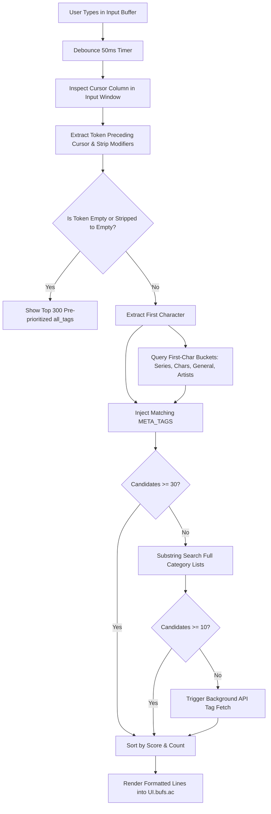

# AGENTS.md — Technical Architecture & Contributor Specification for `gelbooru.nvim`

This document is the primary technical reference and architectural specification for AI agents and human maintainers working on `gelbooru.nvim`. It provides an authoritative description of the plugin's architecture, user interface, networking layer, hybrid library engine, tag database, autocomplete pipeline, image rendering system, core engineering invariants, testing protocols, and development roadmap.

---

## 1. Executive Summary

`gelbooru.nvim` is a high-performance, asynchronous Neovim plugin designed for searching, browsing, and inspecting images and metadata from the Gelbooru imageboard directly inside the editor, featuring unified local library browsing and offline booru metadata enrichment.

### Key Capabilities
- **Local Tag Indexing & Instant Autocomplete**: Loads and indexes 100k+ tags across five distinct categories (Series, Characters, Artists, General, Meta). The debounced completion engine provides sub-3ms prefix lookups with popularity-weighted scoring, substring fallbacks, and dynamic API discovery.
- **Unified Online & Local Library Engine**: Browse Gelbooru online or your saved local folders seamlessly through a unified query bar (`local: [tags]` or online tags), sharing layout, history, image rendering, and metadata inspector.
- **Offline Booru Metadata Enrichment**: Enriches locally saved images and videos with live Gelbooru post metadata, tags, ratings, and artist categorization via fast ID extraction and disk caching.
- **In-Editor Image Rendering**: Leverages `snacks.image` (supporting Kitty graphics protocol, Ghostty, Wezterm, and terminal pixel renderers) to display high-resolution post previews inside floating windows. Includes video detection, local disk caching, prefetching, and fallback chains.
- **Interactive Multi-Window UI**: Floating layout featuring a top search bar, live autocomplete dropdown, scrollable post list, full image canvas, expandable metadata inspector, and status line.
- **Zero Heavy Runtime Dependencies**: Pure Lua codebase requiring only Neovim (>= 0.9.0), system `curl`, and an image backend (`snacks.nvim` or `image.nvim`).

---

## 2. Commands, Query Syntax & Interaction Model

### 2.1 Public Commands & Setup
- `:Gelbooru [tags]` (or `:Gelbooru`): Opens the browser window. If initial tags are passed (e.g. `:Gelbooru hatsune_miku rating:general`), immediately executes the search; otherwise opens with focus in the search bar.
- `:GelbooruLocal [dir]`: Opens the local folder browser for saved images and videos (defaults to `config.options.save_dir` if omitted).
- `:GelbooruTags [args]` (alias `:GelbooruTag`): Initiates the background tag scraper and database builder (`:GelbooruTags`), batch tag verification (`:GelbooruTags verify`), or top-down count refresh (`:GelbooruTags refresh`). Displays a floating progress spinner.
- `require("gelbooru").setup(opts)`: Configures paths, network limits, prefetch radius, and logging.

### 2.2 Unified Query Bar Syntax
The top query bar accepts both online and local library search expressions:
- `tag1 tag2 rating:general` — Online Gelbooru search across tags and meta modifiers.
- `local:` or `local: [tags]` — Search default `save_dir` local library, optionally filtering by booru tags or keywords (e.g. `local: zenless_zone_zero`).
- `local:<dir> [tags]` — Search a custom local directory, optionally filtering by tags.
- `id:<digits>` or bare `<digits>` — Directly loads a single post by its Gelbooru numeric ID.

### 2.3 Three-Mode Interaction Model

The UI operates in three distinct, coordinated modes: **Browse Mode** (post list focused), **Metadata Inspector Mode** (`meta` window focused), and **Search Mode** (query input focused).

#### 1. Browse Mode (List Window Focused)
When viewing posts, the post list window is focused with `cursorline` enabled:

| Key | Action | Technical Behavior |
|---|---|---|
| `j` / `k` | Move cursor down / up | Updates `State.cur` and `State.scroll_dir`. Updates history entry. Re-renders post list, triggers debounced preview render (30ms if cached, 150ms if remote), initiates background prefetching/lookahead for adjacent posts, and auto-fetches the next page when nearing the boundary (`#posts - 5`). |
| `gg` / `G` | Jump top / bottom | Navigates to first/last post, synchronizes `State.cur`, and updates preview canvas. |
| `<CR>` | Save image / Notice | In online mode: downloads full-resolution `file_url` to `config.options.save_dir` and automatically caches metadata to `<cache_dir>/meta_<id>.json`. In local mode (or if already saved in `save_dir`): displays local file path notice without triggering download or opening external viewer. |
| `<Tab>` | Next Page | Fetches the next page (`pid = State.page + 1`) from the Gelbooru API and appends posts (online search). |
| `<S-Tab>` | Previous Page | Rewinds to the previous page by removing the oldest batch of posts and decrementing `State.page`. |
| `r` | Re-render preview | Resets `State.cur_id` and re-renders current post preview canvas and metadata without deleting cached files. |
| `R` | Force refresh | Invalidates volatile preview cache in `/tmp/gelbooru_cache/prev_<id>.<ext>` and metadata cache in `<cache_dir>/meta_<id>.json`, clears snacks image cache, and re-fetches metadata and preview from network. Strictly **NEVER** touches, modifies, or deletes permanent files in `save_dir` or local user libraries. |
| `m` | Toggle metadata panel | Toggles `State.show_meta` boolean. Recalculates floating layout dimensions via `calc_layout()`, hides or displays the metadata window (`wins.meta`) and divider (`wins.hdiv`), and adjusts preview canvas height. |
| `M` | Focus metadata inspector | Ensures `State.show_meta = true`, recalculates layout, and transfers window focus to `UI.wins.meta` with `cursorline = true` for deep tag inspection. |
| `u` | Quick Artist Search | Single-key artist lookup. Extracts the artist tag of the focused post and immediately populates and queries it in the search bar. |
| `o` | Open post web page | Spawns system default browser with full post page (`https://gelbooru.com/index.php?page=post&s=view&id=...`). |
| `O` | Open locally with media viewer | Opens media file directly in system media viewer (`open` on macOS honoring Finder default such as IINA, `xdg-open` on Linux, or user-configured `config.options.media_player`). If post is not downloaded yet, automatically downloads it to `save_dir` first, then opens it locally. |
| `<` / `>` | Adjust explorer width | Increments or decrements post list width ratio (`State.list_width_ratio`, clamped 0.10–0.40, default 0.25), dynamically resizing image canvas and nudging placement. |
| `\` | Toggle Zen Mode | Collapses post list to 0 width, allocating 100% of display width to the image canvas for full-screen viewing; pressing `\` restores list. Transfers focus to image canvas and disables list cursorline to eliminate cursor artifacts. |
| `i`, `I`, `a`, `A`, `s`, `S`, `/` | Enter Search Mode | Shifts focus to input window, enters insert mode, sets `State.input_focused = true`, pops open autocomplete dropdown (`wins.ac`), and updates completion candidates. |
| `[` / `]` | Previous / Next History | Navigates search history stack (`history_prev` / `history_next`), restoring queries, post arrays, and cursor positions. |
| `<C-d>` / `<C-u>` | Scroll metadata | Scrolls metadata text buffer down / up by 5 lines without shifting focus. |
| `<ScrollWheelDown>` / `<ScrollWheelUp>` | Scroll metadata | Scrolls metadata text buffer by 3 lines via mouse wheel. |
| `q` / `<Esc>` | Quit / Close | Initiates complete UI teardown: cancels timers, terminates in-flight downloads, closes all floating windows, resets state tables, and triggers garbage collection. |

#### 2. Metadata Inspector Mode (Meta Window Focused)
Entered via `M` from the list window:

| Key | Action | Technical Behavior |
|---|---|---|
| `h`, `j`, `k`, `l`, `w`, `b`, `e` | Native cursor navigation | Standard Vim motion across metadata lines, artist credits, and tag badges. |
| `gg` / `G` | Jump to top / bottom | Navigates to first line (`ID: ...`) or bottom of tag list. |
| `<C-d>` / `<C-u>`, `<C-f>` / `<C-b>` | Page scrolling | Half-page and full-page scrolling natively in metadata buffer. |
| `v`, `V`, `y` | Visual select & yank | Standard Vim yanking allows copying exact tag names or post IDs directly into registers. |
| `q`, `<Esc>`, `M` | Return to post list | Restores focus to `UI.wins.list` without altering scroll position. |
| `m` | Hide & return to list | Sets `State.show_meta = false`, recalculates layout to hide meta panel, and returns focus to `UI.wins.list`. |
| `u` | Quick Artist Search | Immediately queries the artist of the active post in the search bar. |
| `/`, `i`, `I`, `a`, `A`, `s`, `S` | Jump to search | Transitions directly into Search Mode in the input bar. |
| `o` | Open web page | Opens full post URL (`https://gelbooru.com/index.php?page=post&s=view&id=...`) in default browser. |
| `O` | Open locally | Opens local media file in system viewer (`open`, VLC, IINA, Preview), downloading first if not yet downloaded. |
| `<CR>` | Save image / Notice | In online mode: downloads full-res media to `save_dir`. In local mode: displays local file notice. |

#### 3. Search Mode (Input Window Focused)
When typing in the query bar, the autocomplete window (`wins.ac`) displays matching tags ranked by relevance and category:

| Key | Action | Technical Behavior |
|---|---|---|
| `<Tab>` / `<Down>` / `<C-n>` | Navigate suggestion down | Sets `State.autocomplete_navigated = true`, increments `State.autocomplete_cur`, highlights candidate line in `wins.ac`. |
| `<S-Tab>` / `<Up>` / `<C-p>` | Navigate suggestion up | Sets `State.autocomplete_navigated = true`, decrements `State.autocomplete_cur`, moves highlight line. |
| `<Space>` | Contextual select or space | **If Tab-navigated (`autocomplete_navigated == true` and `cur > 0`)**: Selects highlighted suggestion, appends with trailing space, resets navigation flag.<br>**If typing**: Auto-selects only if typed word is exact/normalized match; otherwise inserts literal space. |
| `<CR>` | Execute search | Reads input line (committing navigated autocomplete candidate if active), exits insert mode, pushes query to history stack, resets pagination, clears current post list, triggers search execution, and starts background lookup for unindexed query tags. |
| `jk` / `<Esc>` / `<C-[>` | Exit search via `InsertLeave` | **Automatic `InsertLeave` autocommand**: Catches all insert-mode exits, automatically clears `State.input_focused`, hides autocomplete popup (`wins.ac`), and restores focus to `UI.wins.list`. |
| `<BS>` (normal mode) | Edit query | Seamlessly re-enters insert mode with backspace behavior, preventing users from getting trapped in normal mode. |
| `q`, `j`, `k` (normal mode) | Defensive exit to list | If input buffer lands in normal mode, pressing `q`, `j`, `k`, or `<Esc>` exits to post list immediately. |
| `i`, `I`, `a`, `A`, `s`, `S`, `/` (normal mode) | Defensive re-enter search | Re-enters insert mode, sets `State.input_focused = true`, and reopens autocomplete popup. |

### 2.4 Mouse Interaction & Boundary Protection
- **Mouse Focus**: Mouse clicks are supported to easily switch focus between interactive windows (`input`, `list`, `meta`). On teardown, original `vim.o.mouse` setting is strictly restored.
- **Window Focus Guards**: Decorative dividers (`frame`, `div`, `vdiv`, `hdiv`, `status`, `ac`) have `focusable = false`.
- **Defensive Boundary Keymaps**: Even if terminal events land in non-interactive buffers, pressing `/` or `i` transitions to search mode, and `q` or `<Esc>` returns to the post list.

---

## 3. Repository Architecture & Module Hierarchy

### 3.1 File Hierarchy

```
gelbooru.nvim/
├── Makefile                          # Test runner, linter, single-spec targets
├── tests/
│   ├── minimal_init.lua              # Headless Neovim test bootstrap (rtp & plenary resolution)
│   ├── unit/
│   │   ├── config_spec.lua           # Options, defaults, clamping, aliasing
│   │   ├── db_spec.lua               # Tag validation (is_clean_tag), indexing, bucketing
│   │   ├── download_spec.lua         # Download engine, deduplication, retry, queue pruning
│   │   ├── history_spec.lua          # Stack push/pop/restore, reference semantics, FIFO cap
│   │   ├── image_spec.lua            # URL parsing, video detection, cache targets
│   │   ├── local_spec.lua            # Local folder scanning, ID parsing, query parsing, enrichment
│   │   └── util_spec.lua             # URL encoding, entity decoding, fuzzy matching
│   └── integration/
│       ├── autocomplete_spec.lua     # Dropdown population, selection index advancement
│       ├── layout_spec.lua           # Layout math, window visibility, metadata formatting
│       ├── local_spec.lua            # End-to-end local browser workflow & query filtering
│       ├── minor_features_spec.lua   # Zen mode, width resizing, hotkey dispatch
│       ├── regressions_spec.lua      # Guards against placement tearing, blanking, locks
│       ├── search_spec.lua           # Search execution, cursor reset, list repainting
│       └── helpers/
│           ├── harness.lua           # Headless environment setup/teardown & memory isolation
│           ├── mock_net.lua          # Network API stubs for curl and async downloads
│           └── mock_snacks.lua       # Mocks snacks.image.placement for headless testing
└── lua/gelbooru/
    ├── init.lua                      # Top-level API entry point & user command bindings
    ├── core/
    │   ├── config.lua                # Configuration defaults, clamping, option normalization
    │   ├── state.lua                 # Global session state singleton (State & UI handles)
    │   ├── history.lua               # Bounded query navigation stack with reference sharing
    │   ├── util.lua                  # Pure helpers (encoding, HTML decode, auth cache, window helpers)
    │   └── log.lua                   # Structured disk logger writing to stdpath("state")/gelbooru.log
    ├── local/
    │   ├── init.lua                  # Local browser facade & open_local orchestrator
    │   ├── index.lua                 # O(1) integer hash index of saved files & mtime validator
    │   ├── indexer.lua               # Dual-tier cursor rush prefetcher & background metadata indexer
    │   ├── query.lua                 # Query parser for local expressions & tag/rating/score filter
    │   └── scan.lua                  # Fast & safe directory scanner & post ID extractor
    ├── net/
    │   ├── init.lua                  # Facade re-exporting API and download submodules
    │   ├── api.lua                   # Gelbooru REST client, query execution, metadata hydration
    │   └── download.lua              # Async curl download queue, dedup, retry, & prefetch scheduler
    ├── tags/
    │   ├── init.lua                  # Facade re-exporting db, fetcher, resolve submodules
    │   ├── db.lua                    # Tag loading, memory indexing, bucketing, validation
    │   ├── fetcher.lua               # Background scraper (:GelbooruTags) with checkpointing & backoff
    │   └── resolve.lua               # Post tag batch resolution & runtime discovered.json cache
    └── ui/
        ├── init.lua                  # Main UI coordinator (layout math, window lifecycle, keymaps)
        ├── autocomplete.lua          # Autocomplete engine (prefix bucketing, scoring, fallback)
        └── image.lua                 # Image placement coordinator (snacks.image, cache paths)
```

### 3.2 Module Responsibilities

#### `lua/gelbooru/init.lua`
Public entry point. Exposes `setup(opts)`, `open(initial_tags)`, `local_browser(dir)`, `browse()`, and `update_tags()`. Connects user-facing commands to core logic.

#### `lua/gelbooru/core/config.lua`
Holds the default configuration table. Normalizes user overrides, clamps numeric ranges using `math.max` and `math.min`, maps tag category IDs to badges and string names, and declares static `META_TAGS` (`id:`, `sort:score`, `rating:general`, etc.).

#### `lua/gelbooru/core/state.lua`
Declares the two foundational singletons:
- `M.State`: Session runtime state (current query, posts array, pagination indices, current cursor, tag category lists, first-letter bucket indices, autocomplete buffers, history stack, saved index).
- `M.UI`: Window IDs, buffer IDs, autocmd group, active placement handle, and libuv timers (`scroll_timer`, `status_timer`, `api_tag_timer`, `ac_debounce_timer`, `save_discovered_timer`, `prefetch_timers`, `resize_timer`).
Provides lifecycle cleanup routines: `reset_query_state()`, `reset_ui()`, and `reset_tag_state()`.

#### `lua/gelbooru/core/history.lua`
Maintains a bounded undo/redo navigation stack for search queries (capped at `MAX_HISTORY = 30`). Stores `posts` arrays by reference. In `restore_history(idx)`, immediately closes active image placement, increments `State.search_epoch`, cancels prefetch timers and indexer tasks, and resets image and metadata buffers.

#### `lua/gelbooru/core/util.lua`
Pure utility functions: URL encoding with proper percent-encoding, alphanumeric string normalization, HTML entity decoding, credential loading, defensive line setters, non-blocking URL and media opener dispatch, and floating window creation wrapper.

#### `lua/gelbooru/net/api.lua`
Handles Gelbooru REST API interactions:
- `fetch(direction)`: Forward and backward post pagination with `search_epoch` validation.
- `execute_search(query)`: Pushes history, clears post state, cancels active prefetch and background indexer, closes active image placement, resets canvas and metadata, normalizes bare numeric IDs, and executes search.
- `save_current()`: Downloads full-size media to `save_dir`, writes metadata JSON to cache, and upgrades active canvas on completion.
- `fetch_post_metadata(p, cb)`: Resolves full booru post details by numeric ID with disk caching and retry tolerance on network failure.

#### `lua/gelbooru/net/download.lua`
Network transfer engine using `vim.system({"curl", ...})`:
- `curl_async(url, cb)`: Lightweight async GET returning response body.
- `download_async(url, dest, cb, opts)`: File downloader with deduplication (`active_downloads[dest]`), atomic writing via temporary `.part` files, referer headers, retry logic, and callback queue pruning.
- `prefetch_around(idx)`: Calculates prefetch indices based on `prefetch_radius` and scroll direction, scheduling staggered async downloads into local preview cache with teardown guards.
- `cancel_pending_resumes()`: Manages and cleans up deferred retry timers.

#### `lua/gelbooru/local/init.lua`
Local folder browser subsystem facade: coordinates `scan_local_folder`, query parsing via `local/query.lua`, canvas clearing, history synchronization, and metadata hydration.

#### `lua/gelbooru/local/index.lua`
Maintains flat integer hash table `saved_index[tonumber(id)] = ext` mapping downloaded files in `save_dir`. Tracks directory `mtime` to avoid redundant filesystem traversal. Exposes `mark_saved(id, ext)` and `reset()`.

#### `lua/gelbooru/local/indexer.lua`
Dual-tier lookahead engine:
- **Tier 1 (High Priority - Cursor Rush)**: Hydrates metadata immediately around active cursor in `scroll_dir`.
- **Tier 2 (Background - Folder Indexer)**: Throttled async queue crawling unindexed posts with max 2 concurrent workers and 100ms pacing, aborted cleanly on navigation or teardown.

#### `lua/gelbooru/local/query.lua`
Unified query expression parser and post filter: parses `local:` and `local:<dir>` prefixes, tags, exact negative exclusions (`-tag`), rating filters (`rating:general`), and numeric score comparisons (`score:>=50`).

#### `lua/gelbooru/local/scan.lua`
Safe directory traversal and post ID extractor using `vim.loop.fs_scandir`. Safely parses filenames with unicode, spaces, multiple dots, and brackets without external shell subshells. Falls back to `fs_stat` when filesystem returns nil `ftype`.

#### `lua/gelbooru/tags/db.lua`
Local tag indexing and categorization: strict validation heuristic (`is_clean_tag`), memory indexing into first-letter bucket tables, and category composite list creation.

#### `lua/gelbooru/tags/fetcher.lua`
Tag database scraper (`:GelbooruTags`): concurrent worker loops, JSON response verification with exponential backoff on Cloudflare/429 HTML responses, live animated progress spinner, memory synchronization on tag absorption, and atomic checkpointing.

#### `lua/gelbooru/tags/resolve.lua`
Dynamic post tag categorization: extracts unindexed tags from posts, batches queries to the Gelbooru tag API, persists discovered tags to `discovered.json` (debounced 500ms), and provides live API fallback when local matches are sparse.

#### `lua/gelbooru/ui/init.lua`
The primary UI coordinator: floating window coordinate math (`calc_layout()`), responsive scaling handling (`VimResized`), window lifecycle, cursor motion synchronization (`gg`, `G`, `CursorMoved`), autocomplete commitment on `<CR>`, preview cooldown timers, and clean teardown.

#### `lua/gelbooru/ui/autocomplete.lua`
Real-time tag autocompletion engine: cursor-column token extraction, sub-3ms lookup using first-character bucket tables, empty token protection, popularity-weighted candidate scoring, and category badge formatting.

#### `lua/gelbooru/ui/image.lua`
Image presentation coordinator: preview URL hierarchy resolution (`sample_url` -> `preview_url` -> `file_url`), video detection (`.mp4`, `.webm`), canvas resets, and `snacks.image.placement` management with non-modifiable buffers and defensive boundary keymaps.

---

## 4. Subsystem Deep-Dives

### 4.1 Window Layout Hierarchy & Geometry

`ui/init.lua` calculates a unified layout occupying 95% of terminal width and height (clamped to minimum 80 columns × 20 rows):

```
┌────────────────────────────────── frame (95% W x 95% H) ───────────────────────────────────┐
│ input: search query bar                                                       [zindex: 51] │
├────────────────────────────────── div: horizontal rule ────────────────────────────────────┤
│ list: 25% W (adjustable via < >)│ img: 75% W (expands to 100% in Zen Mode '\')              │
│ [▶] R ★Score Dims Tags          │ Display canvas rendered via snacks.image                 │
│                                 │                                                          │
│                                 ├────────────────── hdiv: horizontal rule ─────────────────┤
│                                 │ meta: 35% of main_h (toggleable with 'm')                │
│                                 │ ID, Rating, Score, Dimensions, Source, Artists, Tags     │
├────────────────────────────────── status: 1-line bar ──────────────────────────────────────┤
│ status: keymap shortcuts, active page/fetch status, notifications             [zindex: 51] │
└────────────────────────────────────────────────────────────────────────────────────────────┘
        ▲
        │ (When typing, autocomplete dropdown overlays top section)
┌───────┴────────────────────────── ac: autocomplete popup ──────────────────────────────────┐
│ ▶ sort:score                                       [Meta   ]        -         [zindex: 60] │
│   hatsune_miku                                     [Char   ]   142850                      │
│   vocaloid                                         [Series ]   215400                      │
└────────────────────────────────────────────────────────────────────────────────────────────┘
```

#### Geometry Calculation (`calc_layout`)
- Total Width $W = \max(80, \min(\text{columns}, \lfloor \text{columns} \times 0.95 \rfloor))$
- Total Height $H = \max(20, \min(\text{lines}, \lfloor \text{lines} \times 0.95 \rfloor))$
- List Width: In Zen mode, 0; otherwise $\lfloor W \times \text{list\_width\_ratio} \rfloor$ (clamped 0.10–0.40, default 0.25).
- Preview Width: $W - \text{list\_w} - (\text{zen\_mode} ? 0 : 3)$.
- Meta Panel Height: If `State.show_meta` is true, $\max(0, \min(12, \lfloor \text{main\_h} \times 0.35 \rfloor))$; otherwise 0.
- Safe Height Protection: If terminal height is constrained such that `meta_h <= 0`, `l.meta` and `l.hdiv` are excluded from layout creation to prevent invalid zero-height Neovim window exceptions.
- Autocomplete Window: Positioned at row $R + 2$, height $\min(15, H - 4)$, z-index 60.

### 4.2 Autocomplete Algorithm & Scoring Pipeline

The autocomplete engine (`ui/autocomplete.lua`) evaluates queries against 100k+ tags within 3ms:


```mermaid
graph TD
    Input[User Types in Input Buffer] --> Debounce[Debounce 50ms Timer]
    Debounce --> CursorCol[Inspect Cursor Column in Input Window]
    CursorCol --> Parse[Extract Token Preceding Cursor & Strip Modifiers]
    Parse --> EmptyCheck{Is Token Empty or Stripped to Empty?}
    EmptyCheck -- Yes --> AllTags[Show Top 300 Pre-prioritized all_tags]
    EmptyCheck -- No --> FirstChar[Extract First Character]
    FirstChar --> BucketLookup[Query First-Char Buckets: Series, Chars, General, Artists]
    FirstChar --> MetaInject[Inject Matching META_TAGS]
    BucketLookup --> MetaInject
    MetaInject --> CountCheck{Candidates >= 30?}
    CountCheck -- Yes --> SortCandidates[Sort by Score & Count]
    CountCheck -- No --> SubstringFallback[Substring Search Full Category Lists]
    SubstringFallback --> LiveCheck{Candidates >= 10?}
    LiveCheck -- Yes --> SortCandidates
    LiveCheck -- No --> APIFallback[Trigger Background API Tag Fetch]
    APIFallback --> SortCandidates
    SortCandidates --> RenderAC[Render Formatted Lines into UI.bufs.ac]
```

#### Scoring Formula
For each candidate tag matching query $q$:
1. **Match Quality Base Score ($S_{\text{base}}$)**:
   - Exact lowercase match: $35.0$
   - Exact normalized alphanumeric match: $30.0$
   - Prefix lowercase match: $20.0$
   - Prefix normalized match: $15.0$
   - Substring match: $5.0$
2. **Category Weight Nudge ($S_{\text{cat}}$)**:
   - Series / Copyright: $+2.0$
   - Character: $+1.0$
   - Artist: $+0.5$ (prefix-only matching by default)
   - General: $+0.0$
3. **Popularity Weighting ($S_{\text{pop}}$)**:
   $$S_{\text{pop}} = \log_{10}(\text{post\_count} + 1) \times 10.0$$
4. **Total Score**:
   $$\text{Score} = \begin{cases} 1000.0 & \text{if tag is Type 5 (Meta)} \\ S_{\text{base}} + S_{\text{cat}} + S_{\text{pop}} & \text{otherwise} \end{cases}$$

Empty normalized strings are strictly guarded: if `normalize_str(query)` yields `""` (e.g. non-ASCII or Japanese Kanji inputs), prefix/bucket matching falls back cleanly without falsely matching every single tag in the database. Token extraction evaluates cursor column `sub(1, col):match("(%S*)$")` to correctly handle in-place editing in the middle of long query strings.

### 4.3 Unified Hybrid & Local Library Engine

The browser operates as a unified engine bridging remote imageboard queries with local filesystem collections:

```mermaid
graph TD
    Query[User Query Bar Input] --> Route{Query Prefix?}
    Route -- "local:" or "local:<dir>" --> LocalSubsystem[Local Hybrid Subsystem]
    Route -- Online Tags or "id:<digits>" --> OnlineSubsystem[Online Gelbooru API]
    
    LocalSubsystem --> ScanDir[fs_scandir Directory Scan]
    ScanDir --> IDParse[Extract Post IDs from Filenames]
    IDParse --> FastHydrate[Pre-hydrate Cached Metadata in <5ms]
    FastHydrate --> Filter[Apply Filter: tags, -neg, rating, score]
    Filter --> Display[Render Unified Post List with [SAVED] / [VIDEO] Badges]
    
    OnlineSubsystem --> NetFetch[Gelbooru REST API]
    NetFetch --> MatchSaved[Match against local_index Hash Table]
    MatchSaved --> Display
    
    Display --> Nav[Cursor Navigation j/k]
    Nav --> Tier1[Tier 1: Cursor Rush Prefetch in scroll_dir]
    Nav --> Tier2[Tier 2: Background Folder Metadata Indexer]
    
    Display --> SaveCmd[Press Enter to Save]
    SaveCmd --> AtomicDL[Atomic Download to save_dir]
    AtomicDL --> CacheMeta[Persist meta_<id>.json]
    CacheMeta --> UpgradeCanvas[Instant Canvas Upgrade to Full Res]
```

1. **Persistent Metadata Disk Cache**:
   - Post metadata is cached to `config.options.cache_dir .. "/meta_" .. id .. ".json"`.
   - On online save (`<CR>`), full metadata is written to disk alongside the media file.
   - On local folder scan, posts are hydrated from cached JSON files in $<5\text{ms}$ with zero network overhead.
2. **Dual-Tier Lookahead Engine**:
   - **Tier 1 (Cursor Rush)**: Immediate prefetching in `scroll_dir` around cursor (`idx ± prefetch_radius`) via `indexer.cursor_rush_prefetch`.
   - **Tier 2 (Background Crawler)**: Throttled async queue (`start_background_indexing`) crawling unindexed posts with max 2 concurrent workers and 100ms pacing.
3. **Local Tag Filtering**:
   - Supports directory specification (`local:<dir> <tags>`), exact tag matching, negative exclusions (`-tag`), rating criteria (`rating:general`), and score operators (`score:>=50`).
4. **$O(1)$ Hash Table Saved Index**:
   - Flat integer hash table `saved_index[tonumber(p.id)] = ext` (<400KB for 10,000 files) with directory `mtime` cache validation.
   - Online post list displays `[SAVED]` badge for posts present in the index.

### 4.4 Image Presentation & Graphics Pipeline

1. **Target Selection**:
   Resolves preview hierarchy: `sample_url` $\to$ `preview_url` $\to$ `file_url`. Ephemeral cache: `/tmp/gelbooru_cache/prev_<id>.<ext>`.
2. **Buffer Swapping Invariant**:
   `snacks.image` tracks placements by buffer handle. To prevent placement loss or flickering:
   - Create new placement buffer with `bufhidden = "wipe"` and `modifiable = false`.
   - Attach defensive keymaps (`q`, `<Esc>`, `/`, `i`, browsing keys) to the placement buffer.
   - Set window to new buffer **first**.
   - Delete old buffer **second**.
   - Invoke `placement:update()`.
3. **Extmark Spinner Suppression**:
   `snacks.image.placement:progress()` creates an extmark spinner on row 0 that is not wiped when conversion finishes, leaving persistent `convert loading ...` text. Suppressing `placement.progress = function() end` and clearing row 0 extmarks prevents visual clutter while relying on Gelbooru's native placeholders.
4. **Canvas Rescaling & Zen Mode**:
   Resizing list width (`<` / `>`) or toggling Zen mode (`\`) triggers `image.nudge_current_placement()` to dynamically re-scale the active image to full canvas bounds. In Zen Mode, `UI.wins.list` cursorline is disabled and focus transfers to the image canvas.

---

## 5. Configuration Reference & Authentication

Options passed to `require("gelbooru").setup(opts)`:

| Option | Type | Default | Description |
|---|---|---|---|
| `save_dir` | `string` | `"~/Pictures/Gelbooru"` | Local directory where full images are saved on `<CR>`. |
| `auth_file` | `string` | `stdpath("config") .. "/gelbooru_auth.json"` | Path to JSON file with API credentials (`api_key`, `user_id`). |
| `tags_dir` | `string` | `stdpath("data") .. "/gelbooru"` | Storage directory for local tag category databases. |
| `cache_dir` | `string` | `"/tmp/gelbooru_cache"` | Ephemeral disk cache for downloaded preview images and metadata JSONs. |
| `media_player` | `string` | `nil` | Custom media player executable (e.g. `"mpv"`, `"iina"`). If omitted, uses system default. |
| `log_level` | `string` | `"WARN"` | Minimum log verbosity (`"DEBUG"`, `"INFO"`, `"WARN"`, `"ERROR"`). |
| `log_file` | `string` | `stdpath("state") .. "/gelbooru.log"` | Target path for disk logging. |
| `api_base` | `string` | `"https://gelbooru.com/index.php?page=dapi&s=post&q=index&json=1"` | Posts API endpoint. |
| `tags_api` | `string` | `"https://gelbooru.com/index.php?page=dapi&s=tag&q=index&json=1"` | Tags API endpoint. |
| `per_page` | `number` | `42` | Number of posts per page (clamped between 1 and 100). |
| `prefetch_radius`| `number` | `5` | Images ahead/behind to preload (clamped between 0 and 20). |
| `show_tags_in_list`| `boolean`| `false` | When true, renders raw tag text inside list sidebar rows. |

### Authentication Setup
Create `~/.config/nvim/gelbooru_auth.json`:
```json
{
  "api_key": "YOUR_GELBOORU_API_KEY",
  "user_id": "YOUR_GELBOORU_USER_ID"
}
```
When configured, `util.auth_qs()` automatically appends credentials to API calls.

---

## 6. Core Engineering Invariants & Architectural Rules

Maintainers and agents modifying `gelbooru.nvim` **MUST** strictly uphold the following invariants:

### 1. Headless Test Suite Zero-I/O & Memory Isolation
- Integration test harnesses (`harness.setup_all()`) MUST mock `tags.load_tags = function() end` and `download.resume_pending_saves = function() end`.
- Tests must isolate `tags_dir`, `cache_dir`, and `save_dir` to temporary directories (`/tmp/gelbooru_test_*`).
- Headless test runs must never parse live production tag databases (32MB+ JSON) or touch user home directories.
- Total test suite RSS memory must remain $<45\text{MB}$ and execution must complete in $<5\text{s}$.

### 2. Permanent Local Media File Preservation Invariant
- Force refresh (`R`), cache invalidation, or metadata purging strictly **NEVER** touches, modifies, or deletes permanent files in `save_dir` or local user libraries.
- Only volatile preview caches in `/tmp/gelbooru_cache/prev_<id>.<ext>` and metadata caches in `<cache_dir>/meta_<id>.json` may be invalidated.
- Downloads must write atomically via `.part` files with `MIN_VALID_IMAGE_BYTES = 1024` guard before renaming.

### 3. Libuv Timer Lifecycle & Process Safety
- Every libuv timer handle created (`scroll_timer`, `status_timer`, `prefetch_timers`, `indexer_timer`, `resize_timer`, `pending_resumes`) must be stored in `UI` or module state tables.
- On navigation, query change, or `teardown()`, timers must be stopped (`:stop()`), closed (`:close()`), and unreferenced via `cancel_prefetch_timers()` and `cancel_pending_resumes()`.
- Async callbacks must check `if state.State.torn_down then return end` before mutating state or creating timers.
- Subshell execution must be non-blocking; use `vim.uv.fs_utime` rather than blocking `system({"touch", ...})`.

### 4. Search Epoch & In-Flight Async Cancellation
- Every `execute_search()` and `restore_history()` must increment monotonic `State.search_epoch`.
- Async network callbacks must compare captured epoch against `State.search_epoch` and discard stale responses.
- In-flight prefetch downloads and indexer queues must be cancelled on search execution and history navigation.

### 5. Window & Buffer Lifecycle Ordering
- Set the target window's buffer to the new buffer **before** deleting the superseded buffer to avoid placement invalidation or flicker.
- Non-interactive windows (`frame`, `div`, `vdiv`, `hdiv`, `img`, `status`, `ac`) must have `focusable = false` and defensive boundary keymaps.
- Layout geometry must guard against terminal dimensions $\le 7$ rows; never create 0-height floating windows.

### 6. LuaJIT Memory Allocation Pool Discipline & Bounded Capacity
- Never call `vim.deepcopy` on `State.posts` or tag category arrays. Store and pass posts by reference across history and UI layers.
- Bound `State.history` to a strict FIFO cap (`MAX_HISTORY = 30`).
- Teardown must nil out state references and invoke `collectgarbage("collect")` twice.

### 7. Gelbooru API Array Normalization
- When Gelbooru returns exactly one post or tag, JSON deserializes as a dictionary rather than an array. All code consuming `data.post` or `data.tag` must normalize via `util.ensure_array`.

### 8. UI and Worker Re-Entrancy Guards
- `ui.open()` must verify if the UI is already active and avoid duplicating floating window handles.
- `:GelbooruTags` scraper must maintain module-level running flags and validate JSON responses with backoff retries rather than falsely terminating on Cloudflare/429 HTML pages.
- Memory representations (`State.discovered`) must be synchronized when tags are absorbed on disk.

### 9. Prohibition of Global Monkey-Patching
- Production code in `lua/gelbooru/` must strictly NEVER monkey-patch `vim.*` or `vim.api.*` functions.
- Normal mode `<` keymaps are registered with `lhs = "<lt>"`. Test helpers must normalize `<lt>` to `<` instead of mutating Neovim's API table.

### 10. Query Filter Exactness & Boundary Invariants
- Negative tag filtering (`-tag`) must match against whole tag names and stems, preventing substring over-exclusion (e.g. `-solo` must never exclude `solo_focus`).
- Query parser must only treat tokens starting with `/`, `~`, or `.` as directory paths, preventing CWD directory names from shadowing booru tags.
- Unclosed quoted strings at the end of user input must be preserved and salvaged as tokens.

### 11. Media Opener Platform Defaults
- `util.open_media` must honor user's operating system default application (macOS Finder default via `open`, Linux default via `xdg-open`) unless `config.options.media_player` is explicitly configured.

---

## 7. Testing Protocols, Harness & Verification

The repository includes unit and integration test suites using `plenary.nvim` and syntax linting via `luajit`.

### Available Commands

| Command | Action |
|---|---|
| `make test` | Runs all unit and integration specs headlessly using `plenary.busted`. |
| `make test-unit` | Runs unit specs only. |
| `make test-integration` | Runs integration specs only. |
| `make spec FILE=tests/unit/local_spec.lua` | Runs a single test specification file. |
| `make lint` | Runs `luajit -bl` (bytecode check) across all Lua source files. |

### Test Suite Structure
- `tests/unit/`:
  - `config_spec.lua`: Default options, clamping boundaries, key aliasing.
  - `db_spec.lua`: `is_clean_tag` validation rules, tag indexing, bucketing.
  - `download_spec.lua`: Async download queue, deduplication, retry, queue pruning.
  - `history_spec.lua`: Navigation stack push, pop, restore, reference retention, FIFO cap.
  - `image_spec.lua`: URL parsing, video post detection, preview target generation.
  - `local_spec.lua`: Folder scanning, numeric ID parsing, query parsing, enrichment.
  - `util_spec.lua`: URL encoding, entity decoding, normalization, fuzzy matching.
- `tests/integration/`:
  - `search_spec.lua`: Search execution, cursor reset, list repainting.
  - `layout_spec.lua`: Layout math, window visibility, metadata formatting across `m` toggle.
  - `autocomplete_spec.lua`: Dropdown population, selection index advancement.
  - `local_spec.lua`: End-to-end local browser workflow, tag/rating/score filtering.
  - `minor_features_spec.lua`: Zen mode (`\`), explorer width (`<`/`>`), artist quick search (`u`), media dispatch (`O`).
  - `regressions_spec.lua`: Guards against search blanking, placement tearing, artist deadlocks.

---

## 8. Current Feature Branch: `feat/local-folder-browser`

### 8.1 Purpose & Scope
This branch introduces unified local library browsing, offline booru metadata enrichment, and advanced viewing controls to `gelbooru.nvim`. It bridges online imageboard exploration and offline collection management into a single seamless interface.

### 8.2 Completed Architectural Features
- **Unified Query Expression Engine**: Implemented `local:` and `local:<dir>` query support in `lua/gelbooru/local/query.lua`, handling booru tags, negative exclusions (`-tag`), ratings (`rating:general`), and score operators (`score:>=50`).
- **High-Performance File Index**: Implemented flat hash table `saved_index[tonumber(p.id)] = ext` in `lua/gelbooru/local/index.lua` with directory `mtime` validation to avoid redundant disk I/O.
- **Dual-Tier Lookahead Engine**: Implemented cursor rush prefetcher in scroll direction and throttled background metadata crawler in `lua/gelbooru/local/indexer.lua`.
- **Canvas & Playback Polish**: Implemented Zen Mode (`\`), dynamic explorer width adjustment (`<` / `>`), quick artist lookup (`u`), video badge detection (`[VIDEO]`), and instant full-resolution preview upgrades on `<CR>`.
- **Process & Lifecycle Hardening**: Added managed resume timers, teardown guards, non-blocking `uv.fs_utime`, and history FIFO capacity caps.

### 8.3 Active Polish & Integration Focus
- **System Default Media Opener**: Ensuring `util.open_media` delegates to Finder / system default player (e.g. IINA on macOS) rather than hardcoding `mpv`.
- **Snacks Spinner Suppression**: Eliminating persistent `convert loading ...` virtual text extmarks on placement row 0.
- **Zen Mode Focus & Cursor Removal**: Hiding list cursorline and transferring focus to the image canvas in Zen mode.
- **Search Mode Usability**: Enabling mouse click-to-focus recovery, mapping `/` and `<BS>` smoothly in input normal mode, and providing helpful hints on empty queries.

---

## 9. Prioritized Backlog & Future Improvements (Ordered by Severity)

### 9.1 High Severity (Reliability, Process Safety & Network Resilience)

#### 1. Tag Database Engine Overhaul (Live API Verification, Dead Tag Pruning & Top-Down Count Refresh)
- **Problem**: Tag counts in local databases (`series.json`, `characters.json`, etc.) remain frozen from the initial scrape, distorting autocomplete popularity ranking (`log10(count + 1)`). Furthermore, aliased or renamed booru tags leave phantom entries locally that return 0 results when selected from autocomplete.
- **Resolution**:
  - Implement batch verification (`:GelbooruTags verify`) utilizing Gelbooru's multi-tag API (`&names=tag1+tag2+...`) in batches of 50–100 names per request to synchronize counts and reclassify changed tag types across thousands of tags in seconds.
  - Purge dead or aliased tags (tags returning `count == 0` or absent from API responses) from memory and disk.
  - Implement top-down count refresh (`:GelbooruTags refresh`) scraping from page 0 downward to update the top 50,000 most popular tags in place.
  - Implement query-time self-healing: when a single-tag search returns 0 results, query the tag API asynchronously and prune the tag if confirmed dead or aliased.

#### 2. Process Spawn Safety & Queue Deadlock Prevention in `download_async`
- **Problem**: In `lua/gelbooru/net/download.lua`, if `vim.system({"curl", ...})` throws an unhandled error during process spawn (e.g. system file descriptor exhaustion or invalid arguments), `active_downloads[dest]` remains populated with pending callbacks that never resolve, permanently deadlocking subsequent downloads for that destination.
- **Resolution**:
  - Wrap the `vim.system` invocation in `pcall`. If process spawning fails, log the error, delete `active_downloads[dest]`, and immediately invoke queued callbacks with `saved = false` to guarantee queue drainage.

#### 3. In-Flight Background Indexer Process Cancellation
- **Problem**: When navigating directories or exiting the local library browser, `local/indexer.stop()` clears the queue and stops the libuv timer, but any `curl` processes already in flight are not tracked or killed. Their completion callbacks can execute after directory navigation, mutating stale metadata states.
- **Resolution**:
  - Store active `vim.system` process handles in `indexer.active_handles`.
  - In `indexer.stop()`, iterate and terminate all active handles using `pcall(handle.kill, handle, 9)` to ensure immediate process cancellation.

### 9.2 Medium Severity (Performance, Memory & Component Modularization)

#### 4. UI Orchestrator Modularization (`ui/init.lua`)
- **Problem**: `lua/gelbooru/ui/init.lua` is over 1,300 lines long, tightly coupling floating window coordinate math, buffer-local keymap dispatch, preview cooldown timers, and window lifecycle orchestration into a single file.
- **Resolution**:
  - Split `ui/init.lua` into four specialized submodules:
    - `ui/layout.lua`: Layout geometry math (`calc_layout`), responsive scaling, and floating window coordinate calculation.
    - `ui/keymaps.lua`: Buffer-local keymaps for list, meta, input, and placement buffers.
    - `ui/render.lua`: Post list text formatting, metadata panel rendering, and canvas display.
    - `ui/lifecycle.lua`: Open, close, teardown, and autocommand management.
  - Retain `ui/init.lua` as a thin facade re-exporting the submodules without breaking external call sites.

#### 5. Queue Head-Pointer Optimization in Local Indexer
- **Problem**: In `lua/gelbooru/local/indexer.lua`, `process_next_batch()` calls `table.remove(M.queue, 1)`. In large folders containing thousands of images, repeated removal from index 1 shifts all remaining table elements $O(N)$ times, causing avoidable CPU cycles and Lua GC churn.
- **Resolution**:
  - Replace `table.remove(queue, 1)` with an integer cursor pointer (`local head = 1; head = head + 1`). Reclaim the table only when the queue is fully drained or when `M.stop()` is invoked.

#### 6. In-Flight Deduplication & Negative Caching in Tag Resolution
- **Problem**: In `lua/gelbooru/tags/resolve.lua`, `resolve_post_tags()` batches unindexed tags and queries `tags_api`. If multiple posts contain the same unknown tag, concurrent requests fire duplicate queries. Furthermore, tags that return no results from the booru are repeatedly re-queried on subsequent posts.
- **Resolution**:
  - Maintain an `in_flight_queries` set to deduplicate concurrent requests for the same tag.
  - Implement a `negative_tag_cache` hash set for tags confirmed non-existent by the API, skipping redundant network calls during the browsing session.

#### 7. JSON Deserialization Modernization
- **Problem**: Modules across `net/api.lua`, `tags/fetcher.lua`, `tags/resolve.lua`, and `core/util.lua` call `vim.fn.json_decode()`, which incurs Vimscript bridge overhead and extra string allocations.
- **Resolution**:
  - Upgrade all JSON decoding calls to native C-speed `vim.json.decode()` (supported in Neovim >= 0.8), reducing latency and peak memory usage during large API response parsing.

#### 8. Decoupled Autocomplete Cursor Navigation
- **Problem**: In `lua/gelbooru/ui/init.lua`, navigating autocomplete candidates via `<Down>`, `<Up>`, or `<Tab>` calls `autocomplete.update_autocomplete()`, which re-queries first-character buckets, re-scores all candidate tags, and re-sorts the array on every keystroke.
- **Resolution**:
  - Separate candidate query evaluation from dropdown visual selection. When navigating up/down without changing the input string, only update `State.autocomplete_cur` and update the highlight cursor line in `UI.wins.ac` without re-running the scoring pipeline.

#### 9. Centralized Named Constants Table
- **Problem**: Hardcoded magic numbers for layout ratios, debounce timeouts, curl limits, and scoring weights are scattered across modules.
- **Resolution**:
  - Consolidate all constants into a centralized `core/constants.lua` table (`LAYOUT_SCALE = 0.95`, `MIN_WIDTH = 80`, `AC_DEBOUNCE_MS = 50`, `PREVIEW_CACHED_MS = 30`, `PREVIEW_REMOTE_MS = 150`, `TAG_BATCH_SIZE = 40`, `SCORE_EXACT = 35.0`, `POP_MULTIPLIER = 10.0`).

### 9.3 Low Severity (Edge Cases, Isolation & Distribution)

#### 10. Sequential Filename Collision Guard in Local Scanner
- **Problem**: In `lua/gelbooru/local/scan.lua`, `extract_post_id` matches bare numeric filenames (`filename:match("^(%d+)%..+$")`). If a user opens a folder with sequential non-booru files (e.g. `001.jpg`, `1.png`), the scanner extracts IDs `1`, `2`, and queries Gelbooru for unrelated historic posts.
- **Resolution**:
  - Require a minimum post ID threshold (e.g. numeric ID $\ge 10000$ or minimum 5 digits) for bare numeric filenames to be considered Gelbooru post IDs, or check for known booru prefix patterns.

#### 11. Anchored Snacks Image Cache Purge Pattern
- **Problem**: In `lua/gelbooru/ui/image.lua`, `clear_snacks_cache_for(post_id)` globs `~/.cache/nvim/snacks/image/*` and matches `f:find(tostring(post_id), 1, true)`. Unanchored substring matching on small post IDs (e.g. ID `123`) can delete cache files for unrelated posts (e.g. `prev_12345.jpg`).
- **Resolution**:
  - Anchor the pattern match using regex `%f[%d]" .. post_id .. "%f[%D]` and resolve cache paths using `vim.fn.stdpath("cache") .. "/snacks/image/"`.

#### 12. Buffer-Local `mini.completion` Suppression
- **Problem**: `isolate_input_buffer()` disables `nvim-cmp`, `blink.cmp`, and AI plugins, but does not disable `mini.completion`, which can spawn completion windows in the search bar.
- **Resolution**:
  - Add `vim.b[buf].minicompletion_disable = true` to `isolate_input_buffer()`.

#### 13. Distribution Packaging & Metadata Exclusions
- **Problem**: Package managers download developer test suites, makefiles, and documentation artifacts into user runtimes.
- **Resolution**:
  - Add `.gitattributes` configuring `export-ignore` for `tests/`, `Makefile`, and `AGENTS.md` to ensure lightweight installation for end users.

---

### 9.4 Future Product Directions & Architectural Roadmap (Future Scope)

#### 14. Interactive Tag Picker / Deep-Dive Selection Modal (Achievable / High Usability)
- **Concept**: A dedicated floating modal for quickly exploring and querying individual or multiple tags belonging to the active post.
- **Workflow & Interaction**:
  - Hotkey (e.g. `t` or `T` from Browse Mode or Metadata Inspector Mode) opens a centered floating selection window populated with the current post's tags, categorized and badged (Artist, Character, Series, General, Meta).
  - Navigate suggestions with `j` / `k` (or `<Down>` / `<Up>`).
  - Press `<Space>` to select/toggle or immediately activate a tag.
  - Press `<CR>` to commit the selected tag(s) directly into the query bar and trigger a fresh search.
- **Benefit**: Provides an instant, tactile deep-dive mechanism for pivoting to related art and tags without manually typing complex tag names in the search bar.

#### 15. Generalized Multi-Booru Provider Engine & Aggregator Mode (Long-Term Architectural Scope)
- **Concept**: Generalize the API and scraper layers beyond Gelbooru to support arbitrary booru engines (Danbooru, Moebooru, Safebooru, e621, etc.) through a pluggable provider interface.
- **Architectural Scope**:
  - **Pluggable Provider Abstraction**: Decouple REST endpoints, authentication query params, and JSON schema parsing behind a uniform booru client contract (`search(tags, page)`, `fetch_metadata(id)`, `autocomplete(query)`).
  - **Single Provider Switcher**: Allow users to switch active boards globally or per query (e.g. `:Gelbooru --provider danbooru` or `danbooru: <tags>`).
  - **Federated Booru Aggregator**: An aggregated multi-board mode that queries multiple configured boorus concurrently, merges and normalizes results, deduplicates cross-posted media via MD5 / perceptual image hashes, and presents a consolidated browsing stream.
- **Feasibility Assessment**: Deliberately slated for future milestones following hybrid local engine stabilization due to significant architectural scope.
